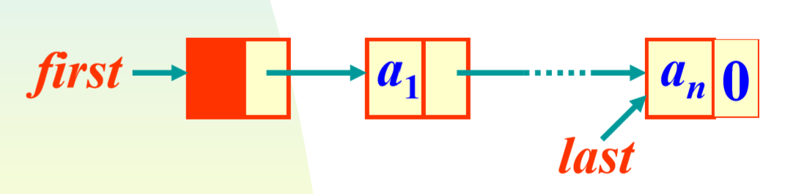

# Project1. Examination registration system

**Author: 1851007 武信庭**

## Catalogue

[TOC]

## 1.Analysis


### 1.1 question background

Examination registration has brought new challenges to college registration, and has added a lot of workload to the educational administration department. This project is a simple simulation of exam registration management. It uses the console option to complete the following functions: input candidate information; output candidate information; query candidate information; add candidate information; modify candidate information; delete candidate information.


### 1.2 functional analysis

The essence of this project is to operate on the candidates' information. The candidate information includes the admission ticket number, name, gender, age, and application type. The design of the project should first determine the data structure of the system, define the member variables and member functions of the class; then implement each member function to complete the corresponding function of the data operation; finally complete the main function to verify the function of each member function and get the running result . The following functions are included:

+ Establishing candidate Information

+ Searching candidate Information

+ Inserting candidate Information

+ Modifying candidate Information

+ Deleting candidate Information


## 2.Design


### 2.1 data structure design

Use a **one-way linked list** as our data structure. Considering that the test registration system needs to meet the free addition and deletion operations without an upper limit on the number of people, a linked list is more suitable. At the same time, in order to achieve simplicity, **a head node is added** before the first node, so that adding or deleting head nodes is the same as processing other nodes, and the program is concise.




### 2.2 class structure design

+ member variables

| Name | Property | Type   |
| ---- | -------- | ------ |
| id   | private  | int    |
| age  | private  | int    |
| name | private  | string |
| sex  | private  | string |
| exam | private  | string |

+ member functions

| Name     | Parameter Type | Description                                         |
| -------- | -------------- | --------------------------------------------------- |
| Input()  | void           | input the information of students                   |
| Insert() | void           | insert the information of students                  |
| Delete() | void           | search and delete the information of students       |
| Lookup() | void           | search the information of student                   |
| Modify() | void           | search and modify the information of students       |
| Output() | void           | statistic students' information and output          |
| Init()   | void           | create the head list and initialize the linked list |

  

### 2.3 systematic design

In order to make input stream sustainable, I choose to use specific case of switch to jump out of while loop and end the program which enables users to end as they want and realize throwing error during instream to make the program stronger. Thus In the main function, I design **a while loop** with a simple **switch operation** for the system to judge calling which functions of class List are inside.


```c++
while(true)
    {
        cout<<"请选择您要进行的操作（1为插入，2为删除，3为查找，4为修改，5为统计，0为取消操作）";
        int n;
        cin>>n;
        while(n<0 || n>5){
            cout<<"抱歉，您想要进行的操作不存在，请重新输入！"<<endl;
            cin>>n;
        }
        switch(n)
        {
            case 1:
                s.Insert();
                s.Output();
                break;
            case 2:
                s.Delete();
                s.Output();
                break;
            case 3:
                s.Lookup();
                break;
            case 4:
                s.Modify();
                s.Output();
                break;
            case 5:
                s.Output();
                cout<<"当前考生总人数为"<<num<<endl;
                break;
            case 0:
                exit(0);
        }
    }
```


## 3.Realization

### 3.1 Input function

**principle**


**core code**

```c++
void List::Input()
{
    cout<<"首先请建立考生信息系统！"<<endl;
    cout<<"请输入考生人数：";
    cin>>num;
    while(num <= 0){
        cout<<"请输入一个正整数！"<<endl;
        cin>>num;
    }
    cout<<"请依次输入考生的考号，姓名，性别，年龄及报考类别！"<<endl;
    head->next= nullptr;
    q=head;
    for(int i=0; i<num; i++)
    {
        p=new List;
        cin>>p->id>>p->name>>p->sex>>p->age>>p->exam;
        p->next=nullptr;
        q->next=p;
        q=p;
    }
}
```
**screenshot**


### 3.2 Insert function

**principle**


**core code**

```C++
void List::Insert()
{
    cout<<"请输入您要插入的考生的位置：";
    int n;
    cin>>n;
    while(n <= 0 || n > num+1){
        cout<<"您输入的位置不合法，请重新输入！"<<endl;
        cin>>n;
    }
    cout<<"请依次输入要插入的考生的考号，姓名，性别，年龄及报考类别！"<<endl;
    q=head;
    while(--n)
    {
        q=q->next;
    }
    p=new List;
    cin>>p->id>>p->name>>p->sex>>p->age>>p->exam;
    p->next=q->next;
    q->next=p;
    num++;
}
```

**screen shot**


### 3.3 Delete function

**principle**


**core code**

```C++
void List::Delete()
{
    cout<<"请输入要删除的考生的考号：";
    int n;
    cin>>n;
    p=head;
    while(p->next)
    {
        if(p->next->id==n)
        {
            q=p->next;
            cout<<"您删除的考生信息是："<<q->id<<"\t"<<q->name<<"\t"<<q->sex<<"\t"<<q->age<<"\t"<<q->exam<<endl;
            p->next=q->next;
            delete []q;
            num--;
            return;
        }
        else
        {
            p=p->next;
        }
    }
    cout<<"查无此人！"<<endl;
}
```

**screen shot**


### 3.4 Search function

**core code**

```C++
void List::Lookup()
{
    cout<<"请输入要查找的考生的考号：";
    int n;
    cin>>n;
    p=head->next;
    while(p)
    {
        if(p->id==n)
        {
            cout<<endl<<"考号\t姓名\t性别\t年龄\t报考类别"<<endl;
            cout<<p->id<<"\t"<<p->name<<"\t"<<p->sex<<"\t"<<p->age<<"\t"<<p->exam<<endl;
            return;
        }
        else
        {
            p=p->next;
        }
    }
    cout<<"查无此人！"<<endl;
}
```

**screen shot**


### 3.5 Modify function

**core code**

```C++
void List::Modify()
{
    cout<<"请输入要修改信息的考生的考号：";
    int n;
    cin>>n;
    p=head->next;
    while(p)
    {
        if(p->id==n)
        {
            cout<<"请以此输入该考生修改后的考号，姓名，性别，年龄及报考类别！"<<endl;
            cin>>p->id>>p->name>>p->sex>>p->age>>p->exam;
            return;
        }
        else
        {
            p=p->next;
        }
    }
    cout<<"查无此人！"<<endl;
}
```

**screen shot**


### 3.6 Output function

**core code**

```C++
void List::Output()
{
    p=head->next;
    cout<<endl<<"考号\t姓名\t性别\t年龄\t报考类别"<<endl;
    while(p)
    {
        cout<<p->id<<"\t"<<p->name<<"\t"<<p->sex<<"\t"<<p->age<<"\t"<<p->exam<<endl;
        p=p->next;
    }
}
```

**screen shot**


## 4.Fault tolerance test

### 4.1 initialization failure

**Test case:** input  unsupported number

**expected result:** give reminder and allow to input again

**actual result:**


### 4.2 delete the first node 

**Test case:** delete the first node 

**expected result:** succeed to delete and don't throw error

**actual result:**


### 4.3 choice number is irregular

**Test case:** input a wrong choice number

**expected result:** remind to input acceptable number

**actual result:**


### 4.4 insert position is irregular

**Test case:** input a wrong position to insert

**expected result:** remind to input acceptable position

**actual result:**


### 4.5 people in delete, search and modify choice don't exist
**Test case:** input a wrong id of people to delete, search or modify

**expected result:** remind to input acceptable number

**actual result:**

