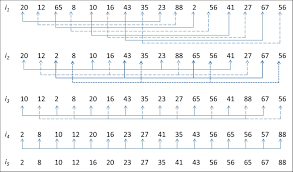
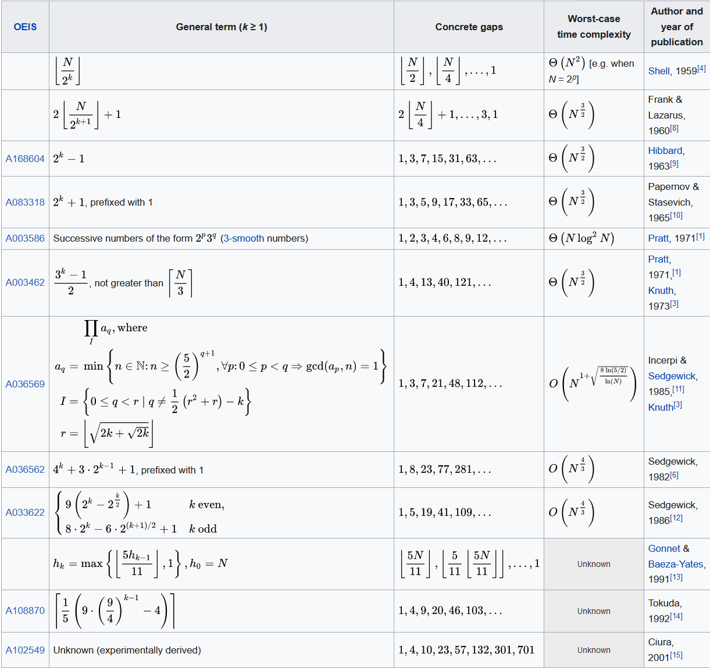
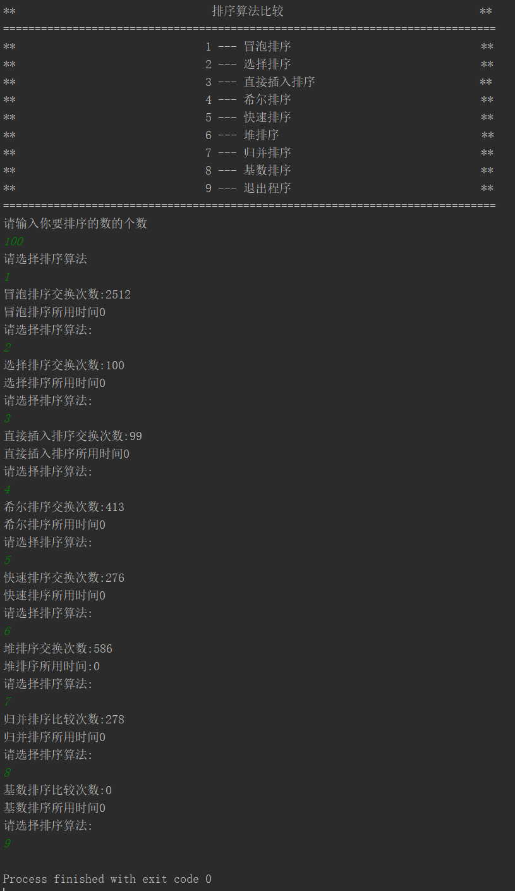
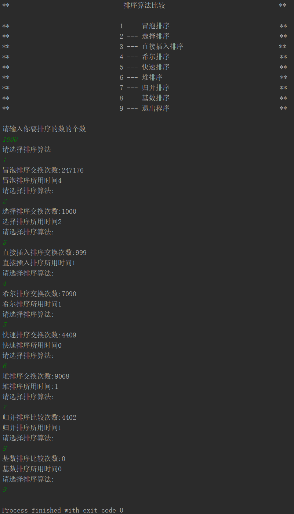
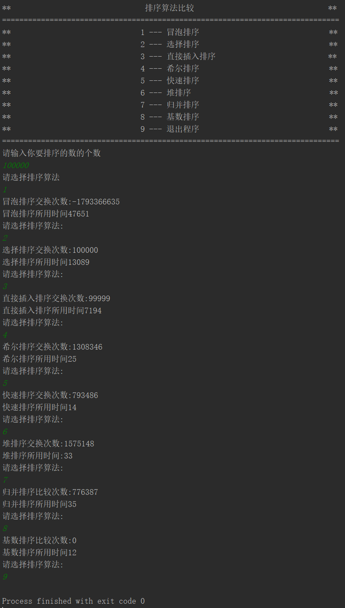

# Project1. Comparison of sorting algorithms

**Author: 1851007 武信庭**

## Catalogue

[TOC]

## 1.Analysis


### 1.1 question background

In computer science, a sorting algorithm is an algorithm that puts elements of a list in a certain order. The most frequently used orders are numerical order and lexicographical order. Efficient sorting is important for optimizing the efficiency of other algorithms (such as search and merge algorithms) that require input data to be in sorted lists. Sorting is also often useful for canonicalizing data and for producing human-readable output. An efficient sorting algorithm can boost the running time of the  programs. Since it's so important and basic in the computer world, it  deserves to be studied, and in this way, a lot of sorting algorithms  were born, including 

+ BubbleSort
+ SelectionSort
+ InsertionSort
+ ShellSort
+ QuickSort
+ HeapSort
+ MergeSort
+ RadixSort


Some of them are easy to code but difficult to comprehend, while some are time-savings but may waste extra space. This problem is like a summarize of these mainstream sort methods. 

| Algorithm      |             | Time Complexity |             |
| -------------- | ----------- | --------------- | ----------- |
|                | **Best**    | **Average**     | **Worst**   |
| Bubble Sort    | Ω(n)        | θ(n^2)          | O(n^2)      |
| Selection Sort | Ω(n^2)      | θ(n^2)          | O(n^2)      |
| Insertion Sort | Ω(n)        | θ(n^2)          | O(n^2)      |
| Shell Sort     | Ω(n log(n)) | depend on gap   | O(n^2)      |
| Quick Sort     | Ω(n log(n)) | θ(n log(n))     | O(n^2)      |
| Heap Sort      | Ω(n log(n)) | θ(n log(n))     | O(n log(n)) |
| Merge Sort     | Ω(n log(n)) | θ(n log(n))     | O(n log(n)) |
| Radix Sort     | Ω(nk)       | θ(nk)           | O(nk)       |


### 1.2 functional analysis

The random function generates one hundred, one thousand, ten thousand, and one hundred thousand random numbers, and uses quick sort, direct insert sort, bubble sort, select sort sort method to sort, and count the sort time and exchange times of each sort. . The number of random numbers is defined by the user, and the system generates random numbers. And show their comparison times.


## 2.Design


### 2.1 sort algorithm design

In the design of sort algorithm, i make sort as several functions together in the sort.h and thus can call function easily in main function.

And in each sort functions, i need to  record the interval and the swap times. I import 'ctime.h' to mark theclock time between start and end time and thus get the total interval time. For swap times, I just define it as zero, and increase each time the swap procss hapenning.

### 2.2 systematic design

In order to make input stream sustainable, I choose to use specific case of switch to jump out of while loop and end the program which enables users to end as they want and realize throwing error during instream to make the program stronger. Thus In the main function, I design **a while loop** with a simple **switch operation** for the system to judge calling which functions of class List are inside.


```c++
while (true && order != 9) {
    
            switch (order) {
                case 1:
                    BubbleSort(sort_array, sort_size);
                    break;
                case 2:
                    SelectionSort(sort_array, sort_size);
                    break;
                case 3:
                    InsertionSort(sort_array, sort_size);
                    break;
                case 4:
                    ShellSort(sort_array, sort_size);
                    break;
                case 5:
                    QuickSort(sort_array, sort_size);
                    break;
                case 6:
                    HeapSort(sort_array, sort_size);
                    break;
                case 7:
                    MergeSort(sort_array, sort_size);
                    break;
                case 8:
                    RadixSort(sort_array, sort_size);
                    break;
                default:
                    cout << "输入发生错误!" << endl;
            }
            cout << "请选择排序算法:" << endl;
            cin >> order;

        }
```


Also, i design the ui for user to choose sort algorithm as they want and input the random number clearly.


## 3.Realization

### BubbleSort

**principle:**

> Bubble sort, sometimes referred to as sinking sort, is a simple sorting algorithm that repeatedly steps through the list, compares adjacent elements and swaps them if they are in the wrong order. The pass through the list is repeated until the list is sorted. The algorithm, which is a comparison sort, is named for the way smaller or larger elements "bubble" to the top of the list. Although the algorithm is simple, it is too slow and impractical for most problems even when compared to insertion sort. Bubble sort can be practical if the input is in mostly sorted order with some out-of-order elements nearly in position. 


This gif depicts the macroscopical transformation when using BubbleSort to sort an array.


**core code:**

```c++
void BubbleSort(int * ori_array, int len){
    int * array = new int[len];
    memcpy(array, ori_array, sizeof(int)*len);
    int compare_times = 0;
    int begin = clock();
    for (int i = 0; i < len-1; ++i) {
        for (int j = 0; j < len - i; ++j) {
            if (array[j] > array[j + 1]) {
                swap(array[j], array[j + 1]);//两两交换
                compare_times++;
            }
        }
    }
    int end = clock();
    cout << "冒泡排序交换次数:" << compare_times << endl;
    cout << "冒泡排序所用时间" << end - begin << endl;
}
```


**analyze:**

+ Bubble sort has a worst-case and average complexity of **О(n2)**, where n is the number of items being sorted. Most practical sorting algorithms have substantially better worst-case or average complexity, often O(n log n). Even other О(n2) sorting algorithms, such as insertion sort, generally run faster than bubble sort, and are no more complex. Therefore, bubble sort is not a practical sorting algorithm. 

+ The swap process only happen between the adjacent elements, we can conclude that BubbleSort is a **stable** sort.


### SelectionSort

**principle:**

> In computer science, selection sort is a sorting algorithm, specifically an in-place comparison sort. It has O(n2) time complexity, making it inefficient on large lists, and generally performs worse than the similar insertion sort. Selection sort is noted for its simplicity, and it has performance advantages over more complicated algorithms in certain situations, particularly where auxiliary memory is limited.

The algorithm divides the input list into two parts: the sublist of items already sorted, which is built up from left to right at the front (left) of the list, and the sublist of items remaining to be sorted that occupy the rest of the list. Initially, the sorted sublist is empty and the unsorted sublist is the entire input list. The algorithm proceeds by finding the smallest (or largest, depending on sorting order) element in the unsorted sublist, exchanging (swapping) it with the leftmost unsorted element (putting it in sorted order), and moving the sublist boundaries one element to the right. 


This gif depicts the macroscopical transformation when using SelectionSort to sort an array.


**core code:**

```c++
void SelectionSort(int * ori_array, int len){
    int * array = new int[len];
    memcpy(array, ori_array, sizeof(int)*len);
    int compare_times = 0;
    int begin = clock();
    for (int i = 0; i < len; ++i) {
        int min_loc = i;
        for (int j = i + 1; j < len; ++j) {
            if(array[j] < array[min_loc]){
                min_loc = j;
            }
        }//选择最大关键码
        swap(array[i],array[min_loc]);
        compare_times++;
    }
    int end = clock();
    cout << "选择排序交换次数:" << compare_times << endl;
    cout << "选择排序所用时间" << end - begin << endl;
}
```


**analyze:**

+ It has **O(n2)** time complexity, making it inefficient on large lists, and generally performs worse than the similar insertion sort. Selection sort is noted for its simplicity, and it has performance advantages over more complicated algorithms in certain situations, particularly where auxiliary memory is limited. 

+ The swap process happen between the remoto elements, it is a **unstable** sort.


### InsertionSort

**principle:**

Insertion sort is a simple sorting algorithm that builds the final sorted array (or list) one item at a time. It is much less efficient on large lists than more advanced algorithms such as quicksort, heapsort, or merge sort. However, insertion sort provides several advantages:

+ Simple implementation: Jon Bentley shows a three-line C version, and a five-line optimized version
+ Efficient for (quite) small data sets, much like other quadratic sorting algorithms
+ More efficient in practice than most other simple quadratic (i.e., O(n2)) algorithms such as selection sort or bubble sort
+ Adaptive, i.e., efficient for data sets that are already substantially sorted: the time complexity is O(kn) when each element in the input is no more than k places away from its sorted position
+ Stable; i.e., does not change the relative order of elements with equal keys
+ In-place; i.e., only requires a constant amount O(1) of additional memory space
+ Online; i.e., can sort a list as it receives it

When people manually sort cards in a bridge hand, most use a method that is similar to insertion sort.

This gif shows a example of InsertionSort:


This gif depicts the macroscopical transformation when using InsertionSort to sort an array.


**core code:**

```c++
void InsertionSort(int * ori_array, int len){
    int * array = new int[len];
    memcpy(array, ori_array, sizeof(int)*len);
    int compare_times = 0;
    int begin = clock();
    int temp_num = 0;
    for (int i = 1; i < len; ++i) {
        temp_num = array[i];
        int j = i;
        while(j > 0 && temp_num < array[j-1]){
            array[j] = array[j-1];
            j--;
        }
        array[j] = temp_num;
        compare_times++;
    }
    int end = clock();
    cout << "直接插入排序交换次数:" << compare_times << endl;
    cout << "直接插入排序所用时间" << end - begin << endl;
}
```


**analyze:**

+ In the average case, the number of key comparisons and object movements is about n ^ 2/4. Therefore, the time complexity of the direct insertion sort is **O(n2)**

+ The swap process only happen between the adjacent elements, we can conclude that BubbleSort is a **stable** sort.

  

### ShellSort

**principle:**

> Shellsort, also known as Shell sort or Shell's method, is an in-place comparison sort. It can be seen as either a generalization of sorting by exchange (bubble sort) or sorting by insertion (insertion sort). The method starts by sorting pairs of elements far apart from each other, then progressively reducing the gap between elements to be compared. Starting with far apart elements, it can move some out-of-place elements into position faster than a simple nearest neighbor exchange. Donald Shell published the first version of this sort in 1959. The running time of Shellsort is heavily dependent on the gap sequence it uses. For many practical variants, determining their time complexity remains an open problem. 
>


Here are the detailed steps of ShellSort: Firstly Initialize the value of `gap`, then divide the list into smaller sub-sequence among which interval is the size of `gap`. After the partition work, sort these sub-lists using insertionSort.  Finally, Repeat this process until gap < 1, which means the list is  sortedcompletely.





This gif depicts the macroscopical transformation when using ShellSort to sort an array.


**core code:**

```c++
void ShellSort(int * ori_array, int len){
    int * array = new int[len];
    memcpy(array, ori_array, sizeof(int)*len);
    int compare_times = 0;
    int begin = clock();
    int gap = (int)(len/2);
    int temp_num = 0;
    while(gap){
        for (int i = gap; i < len; ++i) {
            temp_num = array[i];
            int j = i;
            while (j >= gap && temp_num < array[j - gap]) {
                array[j] = array[j - gap];
                j -= gap;
            }
            array[j] = temp_num;
            compare_times++;
        }
            gap = gap == 2 ? 1 : (int) (gap / 2.2);
    }
    int end = clock();
    cout << "希尔排序交换次数:" << compare_times << endl;
    cout << "希尔排序所用时间" << end - begin << endl;
}
```


**analyze:**

+ 

  

+ Shellsort is **not stable**: it may change the relative order of elements with equal values. It is an adaptive sorting algorithm in that it executes faster when the input is partially sorted

  

### QuickSort

**principle:**

> Quicksort (sometimes called partition-exchange sort) is an efficient sorting algorithm, serving as a systematic method for placing the elements of a random access file or an array in order. Developed by British computer scientist Tony Hoare in 1959 and published in 1961, it is still a commonly used algorithm for sorting. When implemented well, it can be about two or three times faster than its main competitors, merge sort and heapsort.
>

Quicksort is a divide and conquer algorithm. Quicksort first divides a large array into two smaller sub-arrays: the low elements and the high elements. Quicksort can then recursively sort the sub-arrays. The steps are:

1. Pick an element, called a pivot, from the array.
2. Partitioning: reorder the array so that all elements with values less than the pivot come before the pivot, while all elements with values greater than the pivot come after it (equal values can go either way). After this partitioning, the pivot is in its final position. This is called the partition operation.
3. Recursively apply the above steps to the sub-array of elements with smaller values and separately to the sub-array of elements with greater values.
   []

This gif depicts the macroscopical transformation when using QuickSort to sort an array.


**core code:**

```c++
void QSOperation(int *array, int left, int right, int &compare_times){
    if(left<right) {
        int i = left;
        int j = right;
        int key = array[i];
        while (i != j) {
            while (i < j && array[j] > key) {
                j--;
            }
            if (i < j) {
                array[i++] = array[j];//右侧较小数
                compare_times++;
            }
            while (i < j && array[i] < key) {
                i++;
            }
            if (i < j) {
                array[j--] = array[i];//左侧较大数
                compare_times++;
            }
        }
        array[i] = key;//放入关键数
        compare_times++;
        QSOperation(array, left, i - 1,compare_times);
        QSOperation(array, j + 1, right,compare_times);
    }
}

void QuickSort(int * ori_array, int len){
    int * array = new int[len];
    memcpy(array, ori_array, sizeof(int)*len);
    int compare_times = 0;
    int begin = clock();
    QSOperation(array, 0, len - 1,compare_times);
    int end = clock();
    cout << "快速排序交换次数:" << compare_times << endl;
    cout << "快速排序所用时间" << end - begin << endl;
}
```


**analyze:**

+ Mathematical analysis of quicksort shows that, on average, the algorithm takes **O(nlogn)** comparisons to sort n items. In the worst case, it makes **O(n2)** comparisons, though this behavior is rare. 

+ The swap process happen between the remoto elements, it is a **unstable** sort.

  

### HeapSort

**principle:**

> Heapsort was invented by J. W. J. Williams in 1964. This was also the birth of the heap, presented already by Williams as a useful data structure in its own right. In the same year, R. W. Floyd published an improved version that could sort an array in-place, continuing his earlier research into the treesort algorithm.

In computer science, heapsort is a comparison-based sorting algorithm. Heapsort can be thought of as an improved selection sort: like that algorithm, it divides its input into a sorted and an unsorted region, and it iteratively shrinks the unsorted region by extracting the largest element and moving that to the sorted region. The improvement consists of the use of a heap data structure rather than a linear-time search to find the maximum

This gif depicts the macroscopical transformation when using HeapSort to sort an array.


**core code:**

```c++
void HeapOpeartion(int * array, int i, int len, int &compare_times) {
    int temp = array[i];//先取出当前元素i
    for (int k = i * 2 + 1; k < len; k = k * 2 + 1) {//从i结点的左子结点开始，也就是2i+1处开始
        if (k + 1 < len && array[k] < array[k + 1]) {//如果左子结点小于右子结点，k指向右子结点
            k++;
        }
        if (array[k] > temp) {//如果子节点大于父节点，将子节点值赋给父节点（不用进行交换）
            array[i] = array[k];
            i = k;
            compare_times++;
        }
        else {
            break;
        }
    }
    array[i] = temp;//将temp值放到最终的位置
}
void HeapSort(int * ori_array, int len){
    int * array = new int[len];
    memcpy(array, ori_array, sizeof(int)*len);
    int compare_times = 0;
    int begin = clock();
    for (int i = len / 2 - 1; i >= 0; --i) {
        HeapOpeartion(array, i, len, compare_times);
    }
    for (int i = len-1; i >= 0; --i) {
        compare_times++;
        swap(array[i],array[0]);
        HeapOpeartion(array,0,i, compare_times);
    }
    int end = clock();
    delete[]array;
    cout << "堆排序交换次数:" << compare_times << endl;
    cout << "堆排序所用时间:" << end - begin  << endl;
}
```


**analyze:**

+ Although somewhat slower in practice on most machines than a well-implemented quicksort, it has the advantage of a more favorable worst-case **O(n log n)** runtime. 
+ Heapsort is an in-place algorithm, but it is **not a stable sort**.


### MergeSort

**principle:**

> In computer science, merge sort (also commonly spelled mergesort) is an efficient, general-purpose, comparison-based sorting algorithm. Most implementations produce a stable sort, which means that the order of equal elements is the same in the input and output. Merge sort is a divide and conquer algorithm that was invented by John von Neumann in 1945. A detailed description and analysis of bottom-up mergesort appeared in a report by Goldstine and von Neumann as early as 1948.
>


Conceptually, a merge sort works as follows:

1. Divide the unsorted list into *n* sublists, each containing one element (a list of one element is considered sorted).

2. Repeatedly [merge](https://en.wikipedia.org/wiki/Merge_algorithm) sublists to produce new sorted sublists until there is only one sublist remaining.  This will be the sorted list.


This gif depicts the macroscopical transformation when using MergeSortto sort an array.


**core code:**

```c++
void merge(int* array, int mid, int len, int &compare_times){
    int * temp = new int[len];
    int i = 0;//左序列指针
    int j = mid + 1;//右序列指针
    int t = 0;//临时数组指针
    while (i <= mid && j < len) {
        if (array[i] <= array[j]) {
            temp[t++] = array[i++];
            compare_times++;
        }
        else {
            temp[t++] = array[j++];

        }
    }
    while (i <= mid) {//将左边剩余元素填充进temp中
        temp[t++] = array[i++];
    }
    while (j < len) {//将右序列剩余元素填充进temp中
        temp[t++] = array[j++];
    }
    t = 0;
    //将temp中的元素全部拷贝到原数组中
    memcpy(array, temp, sizeof(int) * len);
    delete[]temp;
}

void MSOperation(int * array, int len, int &compare_times) {
    if (len > 1) {
        int mid = (len - 1) / 2;//中间元素的下标
        MSOperation(array, mid + 1, compare_times);//_size是mid+1
        MSOperation(array + mid + 1, len - mid - 1, compare_times);//右边归并排序，使得右子序列有序
        merge(array, mid, len, compare_times);//将两个有序子数组合并操作
    }
}
void MergeSort(int * ori_array, int len) {
    int *array = new int[len];
    memcpy(array, ori_array, sizeof(int) * len);
    int compare_times = 0;
    int start = clock();
    MSOperation(array, len, compare_times);
    int end = clock();
    cout << "归并排序比较次数:" << compare_times << endl;
    cout << "归并排序所用时间" << end - start << endl;
}
```


**analyze:**

+ In the worst case, the number of comparisons merge sort makes is given by the sorting numbers. These numbers are equal to or slightly smaller than **(n(lg n) − 2(lg n) + 1)**, which is between (n lg n − n + 1) and (n lg n + n + O(lg n)).
+ Unlike some (efficient) implementations of quicksort, merge sort is a **stable** sort.


### RadixSort

**principle:**

In computer science, radix sort is a non-comparative sorting algorithm. It avoids comparison by creating and distributing elements into buckets according to their radix. For elements with more than one significant digit, this bucketing process is repeated for each digit, while preserving the ordering of the prior step, until all digits have been considered. For this reason, radix sort has also been called bucket sort and digital sort.

Here is an example of RadixSort:


**core code:**

```c++
void RSOperation(int * array, int len, int exp)
{
    int i, buckets[10] = { 0 };
    int * outputs = new int[len];

    for (i = 0; i < len; i++)
        buckets[(array[i] / exp) % 10]++;

    for (i = 1; i < 10; i++)
        buckets[i] += buckets[i - 1];

    for (i = len - 1; i >= 0; i--)
    {
        outputs[buckets[(array[i] / exp) % 10] - 1] = array[i];
        buckets[(array[i] / exp) % 10]--;
    }

    for (i = 0; i < len; i++)
        array[i] = outputs[i];
}

void RadixSort(int * ori_array, int len)
{
    int start = clock();
    int exp;    // 指数。当对数组按各位进行排序时，exp=1；按十位进行排序时，exp=10；...
    int max = ori_array[0];
    for (int i = 1; i < len; i++)
        if (ori_array[i] > max)
            max = ori_array[i];//数组中的最大值
    int * array = new int[len];
    memcpy(array, ori_array, sizeof(int) * len);				   // 从个位开始，对数组a按"指数"进行排序
    for (exp = 1; max / exp > 0; exp *= 10) {
        RSOperation(array, len, exp);
    }
    int end = clock();
    cout << "基数排序比较次数:" << 0 << endl;
    cout << "基数排序所用时间" << end - start << endl;
}
```


**analyze:**

+ Radix sorts operates in **O(nw)** time, where n is the number of keys, and w is the key length. LSD variants can achieve a lower bound for w of 'average key length' when splitting variable length keys into groups as discussed above.

+ RadixSort is **not a stable sort**.

  

## 4.Test

### 4.1 100 number case




### 4.2 1000 number case




### 4.3 10000 number case


### 4.4 100000 number case



(bubblesort swap times has overflowed)