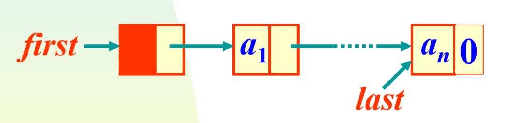
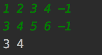
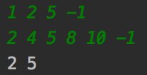
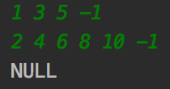
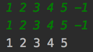
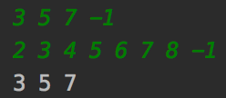
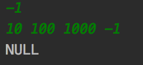
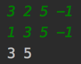

# Project2. Intersection of two ordered linked list sequences

**Author: 1851007 武信庭**

## Catalogue

[TOC]

## 1.Analysis


### 1.1 question background

How to get the intersection part of two ordered linked list? It always  appear as an algorithm problem since it's not very complicated. In fact, this question is an abstraction of some actual problems. for example, a businese man runs two kinds of busineses, and in each one he use list to store his clients' information, ordered by id. If this  businese man wanted to see who are both in his two businese, He would  face this problem.


### 1.2 functional analysis

To solve this problem, we need a core function to execute intersection  operation, this function passes in two lists: list1 and list2. For the two sequences s1 and s2 to be merged, create a result chain s3. When one of s1 and s2 is NULL then directly output NULL, otherwise use two pointers to traverse the two linked lists one by one. If the content pointed by s1 pointer is less than s2 Then move the s1 pointer back, and vice versa. Until one side is empty, if they are the same, create a new node in s3 to store the same value and then move the s1, s2 pointers back at the same time, knowing that one side is empty.

+ Input description: The input is divided into 2 lines, and a non-descending sequence composed of several positive integers is given in each line. The end of the sequence is represented by -1 (-1 does not belong to this sequence). Numbers are separated by spaces.

+ Output description: Output the intersection sequence of the two input sequences in one line, separated by spaces between the numbers, and there must be no extra spaces at the end; if the new linked list is empty, output NULL.


## 2.Design


### 2.1 data structure design

Use a **one-way linked list** as our data structure. Considering that the list needs to meet the free addition and intersection judgement without an upper limit on the number of people, a linked list is more suitable. At the same time, in order to achieve simplicity, **a head node is added** before the first node, so that adding or deleting head nodes is the same as processing other nodes, and the program is concise.




### 2.2 class structure design

+ member variables

| Name | Property | Type |
| ---- | -------- | ---- |
| Num  | Public   | int  |
| Next | Public   | Int* |


## 3.Realization

### 3.1 Input function

**principle**


**core code**

```c++
p = head1;//读入第一个序列
    while(true){
        cin>>input;
        if(input == -1){
            break;
        }
        else{
            flag1 = 1;
            len1++;
            tem = new list;
            tem->num = input;
            tem->next = nullptr;
            p->next = tem;
            p = tem;
        }
    }

p = head2;//读入第二个序列
    while(true){
        cin>>input;
        if(input == -1){
            break;
        }
        else{
            flag2 =1;
            len2++;
            tem = new list;
            tem->num = input;
            tem->next = nullptr;
            p->next = tem;
            p = tem;
        }
    }
```


### 3.2 judge function


example**

| 序号 | 输入                      | 输出      | 说明                                            |
| ---- | ------------------------- | --------- | ----------------------------------------------- |
| 1    | 1 2 5 -1 2 4 5 8 10 -1    | 2 5       | normal cases                                    |
| 2    | 1 3 5 -1 2 4 6 8 10 -1    | NULL      | the intersection is empty                       |
| 3    | 1 2 3 4 5 -1 1 2 3 4 5 -1 | 1 2 3 4 5 | Perfectly intersected case                      |
| 4    | 3 5 7 -1 2 3 4 5 6 7 8 -1 | 3 5 7     | one of the sequences is completely intersection |
| 5    | -1 10 100 1000 -1         | NULL      | one of the sequences is empty                   |


core code**

```C++
for (int i = 0; i < len1; ++i) {//取交集
		p = p->next;
		q = head2->next;
    for (int j = 0; j < len2; ++j) {
        if (p->num == q->num) {
        		len3++;
         		tem = new list;
    		    tem->num = p->num;
   		      tem->next = nullptr;
     		    r->next = tem;
     		    r = tem;
         		break;
   	    }
        else {
            q = q->next;
        }
    }
}
```


### 3.3 output function

**core code**

```C++
if(head3->next == nullptr){//若交集为空
            cout<<"NULL"<<endl;//直接输出NULL
            return 0;
}

else{//若为空
    cout<<"NULL"<<endl;//直接输出NULL
    return 0;
}

r = head3->next;
for (int k = 0; k < len3; ++k) {
    cout<<r->num<<" ";
    r = r->next;
}
```

**screen shot**




## 4.Fault tolerance test

### 4.1 general condition

**Test case**:

1 2 5 -1 

2 4 5 8 10 -1

**Expected Result**: 

2 5

**Actual Result**:




### 4.2 Non-intersect condition

**Test case:** 

1 3 5 -1 

2 4 6 8 10 -1

**Expected Result:** 

NULL

**Actual Result:**




### 4.3 Same condition

**Test case:**

1 2 3 4 5 -1 

1 2 3 4 5 -1

**expected result:** 

1 2 3 4 5

**actual result:**




### 4.4 Inclusion condition

**Test case:** 

3 5 7 -1 

2 3 4 5 6 7 8 -1

**expected result:** 

3 5 7

**actual result:**




### 4.5 Empty condition

**Test case:** 

-1 

10 100 1000 -1

**expected result:** 

NULL

**actual result:**




### 4.6 Unordered condition

**Test case:** 

3 2 5 -1 

1 3 5 -1

**expected result:** 

*(For sequences not entered in non-descending order can still get the correct result)*

3 5

**actual result:**

