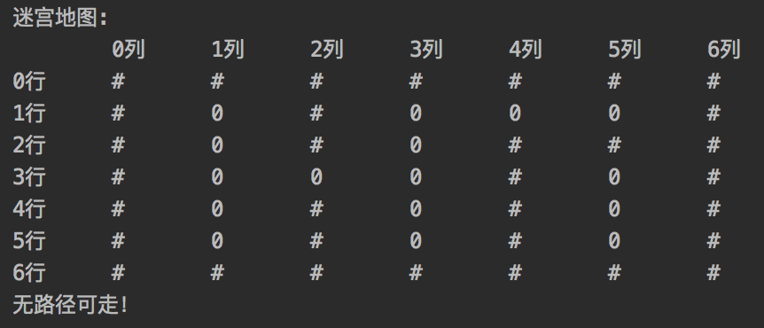

# Project3. Brave Maze Game

**Author: 1851007 武信庭**

## Catalogue

[TOC]

## 1.Analysis


### 1.1 question background

In Greek mythology, King Minos had Theseus thrown into a  complicated maze. But the king didn't know his daughter, Ariadne, had  instantly fallen in love with Theseus, and she had given him a ball of  string to unravel as he entered the maze. Finally, Theseus walked out of the maze with the help of the thread.

So how did he get out of the maze only by a little ball of thread? He just use the backtracking algorithm, and the function of the thread is  to mark the road that has travelled.

And the solution of the problem is just like this story.


### 1.2 functional analysis

The maze problem can be solved by using the retrospective method, that is, searching under certain constraint conditions to search forward, and if the progress is blocked, then go back in time to correct the wrong alternative path and continue searching. Start from the entrance and explore forward in a certain direction. If you can get through, that is, reach a certain point, then reach a new point, otherwise explore the next direction; if there is no access in all directions, return to the previous point along the original road. Change direction and continue testing until all possible paths are explored, or a path is found, or there is no way to go and return to the entry point. In the solution process, in order to ensure that when you cannot continue to walk forward after reaching a certain point, you can correctly return to the previous one so as to test forward from the next direction, you need to save the bottom of each point that can be reached during the test. Mark and the direction of the point, the trial process ends when the exit is found.

### 1.3 analysis of map

use a default Two-dimensional array as the map of the maze.

```c++
char map[7][7] = {
        '#','#','#','#','#','#','#',
        '#','0','#','0','0','0','#',
        '#','0','#','0','#','#','#',
        '#','0','0','0','#','0','#',
        '#','0','#','0','0','0','#',
        '#','0','#','0','#','0','#',
        '#','#','#','#','#','#','#'
};
```

| Symbol | Meaning       |
| ------ | ------------- |
| #      | Obstacles     |
| 0      | Path points   |
| x      | Passed points |


## 2.Design


### 2.1 data structure design

Use a **stack** as our data structure. As the stack is used frequently and is necessary in the 10 programs, i write a header file named 'stack.h' as self-made data structure which realize the basic function of stl stack that meet the demands of projects.


+ member variables

| Name     | Property | Type  | Description |
| -------- | -------- | ----- | ----------- |
| Top      | private  | int   | 栈顶        |
| Elements | private  | Type* | 元素数组    |
| maxsize  | private  | Int   | 栈容量      |

+ member functions

| Name                | Parameter Type | Description                    |
| ------------------- | -------------- | ------------------------------ |
| stack(int len = 12) | Constructor    | Construct the class            |
| ~stack()            | Destructor     | destruct the class             |
| push(type &n)       | void           | push new elements into stack   |
| pop()               | type           | pop the top element out        |
| get_top()           | type           | get the top element and return |
| MakeEmpty()         | void           | Clear the stack                |
| IsEmpty()           | int            | judge whether empty            |
| IsFull()            | int            | judge whether full             |

  

### 2.2 class structure design

+ member variables

| Name | Property | Type |
| ---- | -------- | ---- |
| x    | Public   | int  |
| y    | Public   | int  |

+ member functions

| Name                      | Parameter Type | Description                                 |
| ------------------------- | -------------- | ------------------------------------------- |
| step(int new_x,int new_y) | Constructor    | Construct the class with new position point |
| step()                    | Constructor    | Construct the class with default function   |


### 2.3 systematic design

Initialize the map of maze and output the map.Besides the map we build at the first, we also need another copied maze to store the place we have traced, in this way the piece won't go back and go into a loop.In addition we are able to easily record the correct path and output conveniently in the end of the program. 


```c++
cout<<"迷宫地图:"<<endl;
    cout << "		0列		1列		2列		3列		4列		5列		6列" << endl;
    for (int i = 0; i <= MaxHei; ++i) {
        cout<<i<<"行"<<"		";
        for (int j = 0; j <= MaxLen; ++j) {
            cout<<map[i][j]<<"		";
        }
        cout<<endl;
    }
    FindPath({1,1});

    if(path.IsEmpty()){//判读是否有路
        cout<<"无路径可走！"<<endl;
        return 0;
    }
    cout<<endl;
    cout << "迷宫路径:" << endl;
    while (!path.IsEmpty()) {
        cout << "<" << path.get_top().x << "," << path.get_top().y << ">" << " --> ";
        answer_map[path.get_top().x][path.get_top().y] = 'x';
        path.pop();
    }
    answer_map[5][5] = 'x';
    cout << "<5,5>" << endl;
    cout<<endl;
    cout<<"走法地图:"<<endl;
    cout << "		0列		1列		2列		3列		4列		5列		6列" << endl;
    for (int i = 0; i <= MaxHei; ++i) {
        cout<<i<<"行"<<"		";
        for (int j = 0; j <= MaxLen; ++j) {
            cout<<answer_map[i][j]<<"		";
        }
        cout<<endl;
    }

    return 0;
```


## 3.Realization

### 3.1 push function

**principle**


**core code**

```c++
template<class type>
void stack<type>::push(type &n) {
    if(IsFull()){
        cerr<<"栈满！"<<endl;
    }
    elements[++top] = n;
}
```


### 3.2 pop function

**principle**


**core code**

```C++
template<class type>
type stack<type>::pop() {
    if(IsEmpty()){
        cerr<<"栈空！"<<endl;
    }
    return elements[top--];
}
```


### 3.3 topget function

**core code**

```C++
template<class type>
type stack<type>::get_top() {
    if(IsEmpty()){
        cerr<<"栈空！"<<endl;
    }
    return elements[top];
}
```


### 3.4 pathfind function

**principle**

Using recursion. The recursive termination condition is to reach the edge of the map. If it is reached, it returns true. For any findPath at the specified coordinates, once it finds that the upper and lower left and right coordinates are not occupied by the obstacle, it enters the findPath function of the corresponding coordinate. And use the return value of findPath to determine whether to push the current coordinates onto the stack (that is, the coordinates are part of the correct path) .If the returned value is false, it proves that the previous path cannot reach the end point. findPath returns false, which itself also returns false for continued use by higher-level functions.


**core code**

```C++
bool FindPath(step cur){
    if(cur.x == 5 && cur.y == 5){
        return true;
    }
    if(cur.y - 1 >= 0 && map[cur.x][cur.y - 1] == '0'){
        map[cur.x][cur.y] = 'x';
        if(FindPath({cur.x, cur.y - 1})){
            path.push(cur);
            return true;
        }
    }
    if(cur.y + 1 <= MaxLen && map[cur.x][cur.y + 1] == '0'){
        map[cur.x][cur.y] = 'x';
        if(FindPath({cur.x, cur.y + 1})){
            path.push(cur);
            return true;
        }
    }
    if(cur.x - 1 >= 0 && map[cur.x - 1][cur.y] == '0'){
        map[cur.x][cur.y] = 'x';
        if(FindPath({cur.x - 1, cur.y})){
            path.push(cur);
            return true;
        }
    }
    if(cur.x + 1 <= MaxHei && map[cur.x + 1][cur.y] == '0'){
        map[cur.x][cur.y] = 'x';
        if(FindPath({cur.x + 1, cur.y})){
            path.push(cur);
            return true;
        }
    }
    else {
        map[cur.x][cur.y] = 'x';
        return false;
    }
    return false;
}
```


## 4.Test

### 4.1 path valid

**expected result:**

show the right path chain and give the map with path

**test result:**


### 4.2 path invalid

**expected result:**

Remind that there is no valid path and return normally

**test result:**

