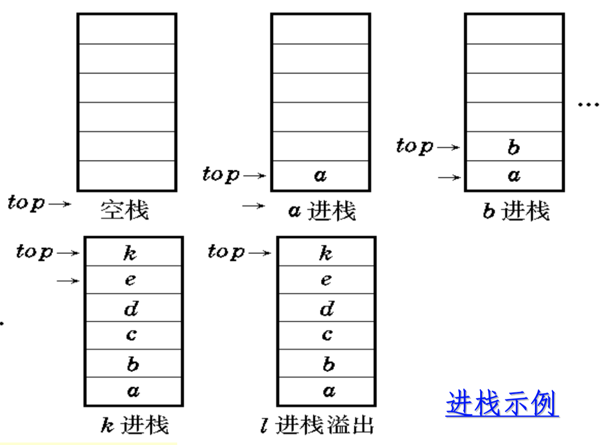

# Project4. Arithmetic expression solving

**Author: 1851007 武信庭**

## Catalogue

[TOC]

## 1.Analysis


### 1.1 question background

In normal life, we usually need to calculate the arithmetic expression by ourselves quickly with our experience. However, the computer calculate with a different way so we need to teach it how to operate.In this process, there are several difficulties we need to solve. Operators have precedence rules. For the general arithmetic expression a * b + (cd / e) * f, if you want to evaluate it, when the computer gets ×, you cannot directly calculate it, you need to continue to evaluate , Find if there is a symbol higher than operation x level, if not then you can calculate. Whether the operand of the operator can be directly operated, and there is no guarantee that both of its operands can be directly operated, for example, for the + of the above formula, its two operands a * b and (cd / e ) * f cannot be operated directly, and the values of a * b and (cd / e) * f need to be further calculated. These difficulties lead to the inconvenience of the computer directly using arithmetic expressions to calculate values, and converting arithmetic expressions to suffix expressions will solve the above difficulties. Later in this passage we will show the RPN expression which help us solve these problems.


### 1.2 functional analysis

+ **Input description:** Enter infix expressions that separate different objects with spaces in one line. It can include +,-, *, /,-, *, /, and left and right parentheses, and the expression must not exceed 20 characters ).
+ **Output description:** The converted suffix expression is output in one line, and different objects (operands, operation symbols) are separated by spaces, but there must be no extra spaces at the end.
+ **Test case：** 2 + 3 * (7-4) + 8/4 ((2 + 3) * 4-(8 + 2)) / 5 1314 + 25.5 * 12 -2 * (+3) 123


In order to coverting a infix expression to a postfix expression, we  need to resort to a stack, which is used to store operators. The core  function in this problem is **convert()**, and this function passes in a string. Another important function is **calrpn()**, used to calaulate the expression which has been transformed. As for the stack structure, it need to contain some basic operations, including push and pop.


### 1.3 RPN

Reverse Polish notation (RPN) is a type of mathematical expression whose grammatical rules can be in summary: ***the operator is immediately after the corresponding (last) operand***. For example, "1 2 +" is usually "1 + 2". According to this rule, more complex expressions can be obtained recursively, such as the RPN expression 1 2 +3 4 ^ * which corresponds to the regular expression (1 +2) * 3 ^ 4.
RPN expressions are also called postfix expressions, and original expressions are called infix expressions. Although RPN expressions are not intuitive and easy to read, their ability to express the precedence of operators is not inferior to conventional infix expressions; and their advantages in computational efficiency are unmatched by conventional expressions. The order in which operators are executed in RPN expressions can be determined more simply, without having to make any conventions in advance, and without using parentheses to force priority changes. Specifically, the order in which the operators are executed exactly matches the order in which they appear in the RPN expression. Taking the above "1 2 + 3 4 ^ *" as an example, the order of the three operations {+, ^, *} is exactly the same as the appearance order of the three operators.


## 2.Design


### 2.1 data structure design

Use a **stack** as our data structure. As the stack is used frequently and is necessary in the 10 programs, i write a header file named 'stack.h' as self-made data structure which realize the basic function of stl stack that meet the demands of projects.


+ member variables

| Name     | Property | Type  | Description |
| -------- | -------- | ----- | ----------- |
| Top      | private  | int   | 栈顶        |
| Elements | private  | Type* | 元素数组    |
| maxsize  | private  | Int   | 栈容量      |

+ member functions

| Name                | Return value type | Description                    |
| ------------------- | ----------------- | ------------------------------ |
| stack(int len = 12) | Constructor       | Construct the class            |
| ~stack()            | Destructor        | destruct the class             |
| push(type &n)       | void              | push new elements into stack   |
| pop()               | type              | pop the top element out        |
| get_top()           | type              | get the top element and return |
| MakeEmpty()         | void              | Clear the stack                |
| IsEmpty()           | int               | judge whether empty            |
| IsFull()            | int               | judge whether full             |

  

### 2.2 Operator precedence design

```c++
int opr_prio(char opr){
    if(opr == '(' ) return 0;

    if(opr == '+' || opr == '-') return 1;

    if(opr == '*' || opr == '/' || opr == '%') return 2;

    if (opr == '^') return 3;

    else{
        return -1;
    }
}
```


### 2.3 systematic design

In the program we need some functions to help us calculate the expressions precisely, so i create the function **cal(int a, int b, int op)** which do the calculation works.


```c++
int cal(int a,int b, int op){//计算函数
    if(op == '+') return b + a;
    else if(op == '-') return b - a;
    else if(op == '*') return b * a;
    else if(op == '/') return b / a;
    else if(op == '%') return b % a;
    else if(op == '^') {
        int ans = 1;
        for (int i = 0; i < a; ++i) {
            ans *= b;
        }
        return ans;
    }
    else return 0;
}
```


In addition, i design a while loop to help detect the error of instream and realize multiple times of input with the corresponding reminder of continuing input controlled by user easily.

```c++
int main() {
    string str;
    char con_flag = 'y';
    while(con_flag == 'y'){
        cout<<"输入表达式："<<endl;
        cin>>str;
        for (int i = 0; i < str.length(); ++i) {//检测非法输入
            if(str[i] == '.'){
                cerr<<"请输入整数！"<<endl;
                str = "0=";
                break;
            }
            if(str[i] >= '0' && str[i] <= '9' && str[i+1] >= '0' && str[i+1] <= '9'){
                cerr<<"请勿重复输入数字！"<<endl;
                str = "0=";
                break;
            }
            if((str[i] == '+' || str[i] == '-' || str[i] == '*' || str[i] == '/'|| str[i] == '^' || str[i] == '%')
            &&(str[i+1] == '+' || str[i+1] == '-' || str[i+1] == '*' || str[i+1] == '/' || str[i+1] == '^' ||str[i+1] == '%')){
                cerr<<"请勿重复输入操作符！"<<endl;
                str = "0=";
                break;
            }
            if(str == "+" || str == "-" || str == "*" || str == "/" || str == "^" || str == "%" || str == "="){
                cerr<<"请至少输入1个操作数！"<<endl;
                str = "0=";
                break;
            }
            if(str[str.length()-1] != '='){
                cerr<<"请在表达式最后输入'='！"<<endl;
                str = "0=";
                break;
            }
        }
        int ans = calrpn(convert(str));
        cout<<ans<<endl;
        cout<<"是否继续 （y, n）?";
        cin>>con_flag;
    }
    return 0;
}
```


## 3.Realization

### 3.1 push function

**principle**




**core code**

```c++
template<class type>
void stack<type>::push(type &n) {
    if(IsFull()){
        cerr<<"栈满！"<<endl;
    }
    elements[++top] = n;
}
```


### 3.2 pop function

**principle**


**core code**

```C++
template<class type>
type stack<type>::pop() {
    if(IsEmpty()){
        cerr<<"栈空！"<<endl;
    }
    return elements[top--];
}
```


### 3.3 topget function

**core code**

```C++
template<class type>
type stack<type>::get_top() {
    if(IsEmpty()){
        cerr<<"栈空！"<<endl;
    }
    return elements[top];
}
```


### 3.4 convert function

**principle**

With the exception of an auxiliary stack, the algorithm does not require any more data structures. In addition, the control flow of the algorithm is also very concise, only one-way sequential scanning of the RPN expression is needed, neither more judgment is needed, nor does it contain any branching or backtracking.

+ **1. If the current operator has higher priority, the top-of-stack operator in optr cannot be executed yet**

Taking the expression "1 + 2 * 3 ..." as an example, when the operator '*' is scanned, the top operator of the optr stack is the previous '+', because pri ['+'] ['*'] = '<', The current operator '*' has higher priority, so the execution of the top operator '+' must be postponed. Please note that the priority table, regardless of the top element of the stack, all cases where the current operator is '(' are unified into this processing method.
In addition, regardless of the current operator, the top operator is All cases of '(' are also handled uniformly. That is, all left brackets and the immediately following operator will be pushed directly into the optr stack one after another, and the previous operators will all be postponed. This exactly matches the function of the left parenthesis.

+ **2. Conversely, once the top-level operator has a higher priority, it can be popped up and executed immediately.**

Taking the expression "1 + 2 * 3-4 ..." as an example, when the operator '-' is scanned, the top operator of the optr stack is '*', because pri ['*'] ['-'] = '>', Which means that the current operator has lower priority, so the top operator '*' can be executed immediately.
Similarly, according to the priority table, regardless of the top element of the stack, the case where the current operator is ')' is almost all included in this processing method. In other words, once the right parenthesis is reached, most of the operators buffered in the optr stack can be popped up and executed one by one, which is exactly the same as the right parenthesis should have.

+ **3. The priority of the current operator and the top operator is "equal"**

The above-mentioned processing method of the right parenthesis will terminate when the operator '(' appears at the top of the optr stack, pri ['('] [')'] = '='. At this time, the '(' Then continue to process the characters after ')'. It is not difficult to see that the pair of left and right brackets must match each other in the expression. Its role is to constrain the priority relationship of the subexpression between the two. After its "historical mission" is completed, the algorithm should do as it should.


**core code**

```C++
string convert(string ori_str){
    stack<char> s;//用栈存操作符
    string original_str(ori_str.length() - 1, ' ');
    string str(2 * original_str.length(), ' ');//中缀字符串
    int i = 0;
    int j = 0;

    for (int l = 0; l < original_str.length(); ++l) {//去除等号
        original_str[l] = ori_str[l];
    }
    int len = original_str.length();
    while (i < original_str.length()) {//处理单目运算符
        if(i == 0 && (original_str[0] == '-'|| original_str[0] == '+')){//首位单目运算符
            str[0] = '(';
            str[1] = '0';
            str[2] = original_str[0];
            str[3] = original_str[1];
            str[4] = ')';
            j += 4;
            i += 1;
            len += 3;
        }
        else if(i>0 && (original_str[i] == '-'|| original_str[i] == '+')
                && original_str[i-1] == '('){//后续单目运算符
            str[j] = '(';
            str[j+1] = '0';
            str[j+2] = original_str[i];
            str[j+3] = original_str[i+1];
            str[j+4] = ')';
            j += 4;
            i += 1;
            len += 3;
        }
        else{
            str[j] = original_str[i];
        }
        i++;
        j++;
    }

    for (int k = 0; k < str.length(); ++k) {//减去括号所占长度
        if(str[k] == '(' || str[k] == ')'){
            len--;
        }
    }
    string rpnstr(len ,' ');//后缀字符串
    int index =0;
    for (int j = 0; j < str.length(); ++j) {//将中缀表达式转换为后缀表达式
        if (str[j] >= '0' && str[j] <= '9') {//若为操作数则暂存字符串
            rpnstr[index++] = str[j];
        }
        else if (s.IsEmpty() || str[j] == '(') {//若栈为空或读入左括号则进栈
            s.push(str[j]);
        }
        else if (str[j] == ')') {//若读入右括号
            while (s.get_top() != '(') {
                rpnstr[index++] = s.pop();
            }
            s.pop();

        }
        else {//若栈不为空且读入操作符优先度小于栈顶操作符则出栈进字符串
            while (!s.IsEmpty() && (opr_prio(str[j]) <= opr_prio(s.get_top()))) {
                rpnstr[index++] = s.pop();
            }
                s.push(str[j]);//出栈完将当前读入操作数进栈
        }
    }
    while(!s.IsEmpty()){//出栈入串至栈空
        rpnstr[index++] = s.pop();
    }
    return rpnstr;//返回字符串
}
```


### 3.5 calculate function

**principle**


**core code**

```C++
int calrpn(string rpn){//计算后缀表达式
    stack<int> ss;
    int tmp;
    for (int i = 0; i < rpn.length(); ++i) {
        if(rpn[i] >= '0' && rpn[i] <= '9'){
            tmp = rpn[i];
            ss.push(tmp - '0');
        }
        else{
            int a = ss.pop();
            int b = ss.pop();
            ss.push(cal(a,b,rpn[i]));
        }
    }
    return ss.IsEmpty() ? 0 : ss.get_top();
}
```


## 4.Test

### 4.1 Normal condition

**Input :** -2*(3+5)+2^3/4=

**Expected Result :** -14

**Actual Result:**


### 4.2 Unary operator condition

**Input :** 2^4/8-(+2+8)%3=

**Expected Result :** 1

**Actual Result:**


### 4.3 missing equation

**Input :** 1+2+3/6

**Expected Result :** 0

**Actual Result:**


### 4.4 non-integer number

**Input :** 1.2+3=

**Expected Result :** 0

**Actual Result:**


### 4.5 repeated number

**Input :** 11+2=

**Expected Result :** 0

**Actual Result:**


### 4.6 repeated operator

**Input :** 1++2=

**Expected Result :** 0

**Actual Result:**


### 4.7 no Operand

**Input :** +

**Expected Result :** 0

**Actual Result:**


## 5.Compilation information

### 5.1 CMakeLists

```c++
cmake_minimum_required(VERSION 3.15)

project(project4)

set(CMAKE_CXX_STANDARD 14)

add_executable(project4 main.cpp)

set(CMAKE_EXE_LINKER_FLAGS -static)
```


### 5.2 File Encoding

+ coding with **GBK**

  

### 5.3 Cross-platform Compilation 

Executables are cross-platform compiled in **Windows(.exe)** and **Linux(.out)**