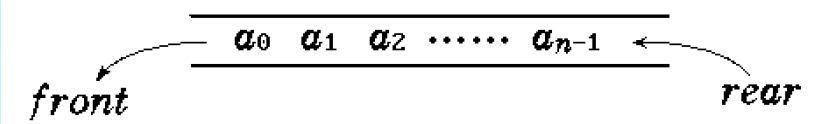
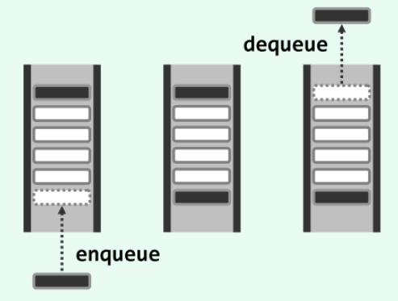
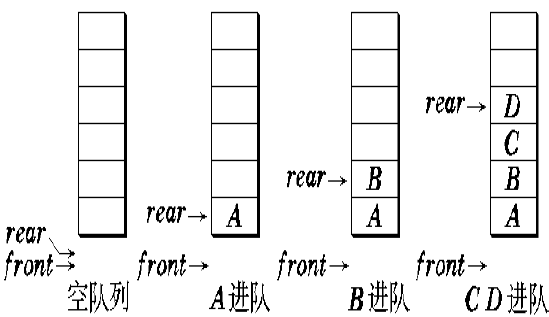
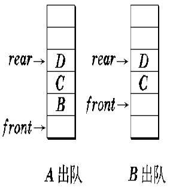
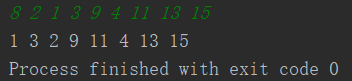
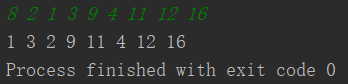
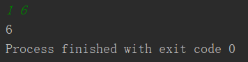

# Project5. Banking Bussinese

**Author: 1851007 武信庭**

## Catalogue

[TOC]

## 1.Analysis


### 1.1 question background

Queue is a common thing in our daily life. Banking bussinese is a  good example: A bank has two business windows, A and B, and the speed of processing business is different. The processing speed of window A is twice that of window B. That is, when window A has processed 2 customers, window B is processed. 1 customer. Given a sequence of customers arriving at the bank, output the sequence of customers in the order in which the business was completed. Assume that the time interval after the customer's letter arrives is not taken into account, and when two customers are processed in different windows at the same time, the customer in window A has priority to output. The number of waiting people is much bigger than the  number of windows. In order to ensure fairness, we ought to follow  FIFO(First-in-First-out) principle, and that's the reason why we nees to use queue to solve lining-up problems.In addition, the efficiency of each window is totally diffrent, by  using queue, we can realize better scheduling, which will reduce the  waiting time.


### 1.2 functional analysis

To realize the specific queue solution, we need firstly eastablish  queue structure. Importing from STL is a way, but building up our own  queue structure is much better. Like the stack, a queue is a container for data objects, and the data objects are arranged in a linear logical order. The queue structure also supports the insertion and deletion of objects, but the scope of the two operations is limited to the two ends of the queue.

If it is agreed that a new object can only be inserted into it from one end, the existing element can only be deleted from the other end. The end that allows elements to be removed is called the front, and the other end that allows to insert elements is called the rear.

It is not difficult to see that, contrary to the stack structure, the operation order of the objects in the queue follows the so-called advanced First-in-first-out (FIFO) rule: The elements that dequeue earlier (late) should be those who enter earlier (late).Conversely, those who join the team earlier (late) should leave earlier (late).

+ **Input description:** Enter a line of positive integers, where the first number N (N <= 1000) is the total number of customers, followed by the number of N customers. Customers with odd numbers need to go to window A for transactions, and customers with even numbers go to window B. Numbers are separated by spaces.
+ **Output description:** The customer number is output in the order in which business processing is completed. The number keys are separated by spaces, but the last number must not have extra spaces.
+ **Test cases:** 8 2 1 3 9 4 11 13 15 8 2 1 3 9 4 11 12 16 1 6


## 2.Design


### 2.1 data structure design

Use a **queue** as our data structure. As the queue is used frequently and is necessary in the 10 programs, i write a header file named 'queue.h' as self-made data structure which realize the basic function of stl stack that meet the demands of projects.





+ member variables

| Name    | Property | Type  | Description |
| ------- | -------- | ----- | ----------- |
| arr     | private  | type* | 列表内元素  |
| count[] | private  | int   | 列表长度    |


+ member functions

| Name            | Return value type | Description                    |
| --------------- | ----------------- | ------------------------------ |
| queue()         | Constructor       | Construct the class            |
| ~queue()        | Destructor        | destruct the class             |
| enqueue(type t) | void              | enqueue new element            |
| dequeue()       | type              | dequeue the element            |
| front()         | type              | get the top element and return |
| size()          | int               | get the size of queue          |
| is_empty()      | int               | judge whether queue is empty   |

  

### 2.2 systematic design

In the program i design two for loop to help construct the queue and output the right order of customer. When the first for loop control the input stream and enqueue the element in the right queue, the second queue control the output stream in the 2:1 sequence.


```c++
for (int i = 0; i < len; ++i) {
        cin>>input;
        if(input % 2 == 0){
            customer_b.enqueue(input);
        }
        else{
            customer_a.enqueue(input);
        }
    }
for (int j = 0; j < len; ++j) {
    if (!customer_a.is_empty()) {
        cout << customer_a.dequeue() << " " << customer_a.dequeue() << " ";
    }
    if(!customer_b.is_empty()){
        cout << customer_b.dequeue() << " " ;
    }
    if(customer_a.is_empty() && customer_b.is_empty()){
        return 0;
    }
}
```





## 3.Realization

### 3.1 enqueue function

**principle**





**core code**

```c++
template<class type>
void queue<type>::enqueue(type t) {
    arr[count++] = t;
}
```


### 3.2 dequeue funtion

**principle**




**core code**

```C++
template<class type>
type queue<type>::dequeue() {
    if(count == 0){
        cerr<<"队列为空！"<<endl;
    }
    type ans = arr[0];
    count--;
    for (int i = 0; i < count; ++i) {
        arr[i] = arr[i+1];
    }
    return ans;
}
```


### 3.3 get front function

**core code**

```C++
template<class type>
type queue<type>::front() {
    return arr[0];
}
```


### 3.4 get size function

**core code**

```C++
template<class type>
int queue<type>::size() {
    return count;
}
```


### 3.5 empty judgement function

**core code**

```C++
template<class type>
int queue<type>::is_empty() {
    if(count == 0){
        return 1;
    }
    return 0;
}
```


## 4.Test

### 4.1 Normal test (window A has more people)

**Input :**   8 2 1 3 9 4 11 13 15 

**Expected Result :**   1 3 2 9 11 4 13 15  

**Actual Result:**




### 4.2 Normal test (window B has more people)

**Input :**   8 2 1 3 9 4 11 12 16  

**Expected Result :**   1 3 2 9 11 4 12 16  

**Actual Result:**




### 4.3 minimum n

**Input :** 1 6

**Expected Result :** 6

**Actual Result:**

 


## 5.Compilation information

### 5.1 CMakeLists

```c++
cmake_minimum_required(VERSION 3.15)

project(project5)

set(CMAKE_CXX_STANDARD 14)

add_executable(project5 main.cpp)

set(CMAKE_EXE_LINKER_FLAGS -static)
```


### 5.2 File Encoding

+ coding with **GBK**

  

### 5.3 Cross-platform Compilation 

Executables are cross-platform compiled in **Windows(.exe)** and **Linux(.out)**