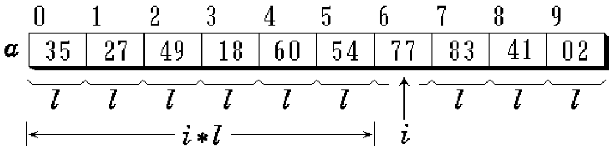

# Project6. Family tree management system

**Author: 1851007 武信庭**

## Catalogue

[TOC]

## 1.Analysis


### 1.1 question background

Genealogy is a special book genre in the form of a genealogy, which records a family's hereditary reproduction and important missions. Genealogy is a unique cultural heritage in China. It is one of the three major documents of the Chinese nation (national history, topography, genealogy). It belongs to precious humanities and have their unique and irreplaceable features. This project performs a simple simulation of family tree management to achieve the functions of viewing personal information of ancestors and offspring, inserting family members, and deleting family members.


### 1.2 functional analysis

The essence of this project is to complete the function of family tree member information. We can first define the family member data structure, and then use each function as a member function to complete the data operation Finally, complete the main function to verify the function of each function and get the running result. We will adopt the tree structure as data structure and realize the corresponding functions listed belowed:

+ create family tree members

+ search family tree members

+ insert family tree members

+ modify family tree members

+ delete family tree members


## 2.Design


### 2.1 data structure design

I use  **tree** as data structure. As the queue is used frequently and is necessary in the 10 programs, i write a header file named 'tree.h' as self-made data structure which realize the basic function of stl stack that meet the demands of projects.

The n-fork tree is used to implement the connection between each member and child in the familyTree. Each member of the vector is traversed during access to construct the entire family into a tree structure. When adding a new family member, simply add members in the vector. Similarly, when dismissing a family member, clear the vector and shrink_to_fit. When perfecting family members, just add a member to the vector.

When you need to add family members to use, first perform a search function to find someone. After finding it, add the linked list below the node. The sibling node is connected after the sibling pointer, and the child is connected after the child. When adding a child, you need to check whether the child pointer is empty. If it is not empty, move the operation pointer to the last child, and then operate the siblling. If there is no child, directly Connect this node to the child node.


+ member variables

| Name     | Property | Type               | Description |
| -------- | -------- | ------------------ | ----------- |
| children | private  | vector<tree_node*> | 子节点      |
| name     | private  | T                  | 节点关键码  |


+ member functions

| Name                                               | Return value type | Description                   |
| -------------------------------------------------- | ----------------- | ----------------------------- |
| tree_node()                                        | Constructor       | Construct the class           |
| tree_node(T cur_name)                              | tree_node         | Construct the class with name |
| addChild(tree_node *child)                         | void              | add new child                 |
| eliminate()                                        | void              | eliminate child               |
| changeName(tree_node &target)                      | void              | change the name               |
| noChildren()                                       | bool              | judge whether have children   |
| getName()                                          | T                 | return the name               |
| printChidren()                                     | void              | print node's children         |
| searchNode(tree_node & target)                     | tree_node *       | search specific node          |
| operator >> (istream & is, tree_node<T> & _person) | istream&          | operator overloaded           |


In the relization of tree structure, i meet the problem of save the unknown size of child node of each parents node, so i wirte one more structure called **vector** which is a especially useful container  in these 10 programs as the header file 'vector.h'.Cause i use it simply as an various length array, i just add push_back and several basic function to it.  




+ member variables

| Name    | Property | Type  | Description |
| ------- | -------- | ----- | ----------- |
| size    | private  | int   | 数组大小    |
| space   | private  | int   | 数组容量    |
| element | private  | type* | 元素        |


+ member functions

| Name                               | Return value type | Description                                    |
| ---------------------------------- | ----------------- | ---------------------------------------------- |
| Vector()                           | Constructor       | Construct the class                            |
| Vector(int len)                    | Constructor       | Construct the class with length                |
| Vector(const Vector& other)        | Constructor       | Construct the class with another copied vector |
| Vector(initializer_list<type>list) | Constructor       | Construct the class with list                  |
| ~Vector()                          | Destructor        | Destruct the class                             |
| operator[] (int i)                 | type&             | overloaded operator []                         |
| reserve(int newalloc)              | void              | reserve new space                              |
| push_back(type &val)               | void              | add element                                    |
| get_size() const                   | int               | get the size of vector                         |
| del()                              | void              | delete the vector                              |


### 2.2 class structure design

+ member functions

| Name            | Return value type | Description                       |
| --------------- | ----------------- | --------------------------------- |
| buildTree()     | void              | build the family tree's root node |
| buildFamily()   | void              | build the family tree node        |
| perfectFamily() | void              | perfect the family tree           |
| disbandFamily() | void              | disband the family                |
| replaceMember() | void              | replace family member's name      |

 

### 2.3 systematic design

In order to make input stream sustainable, I choose to use specific case of switch to jump out of while loop and end the program which enables users to end as they want and realize throwing error during instream to make the program stronger. Thus In the main function, I design **a while loop** with a simple **switch operation** for the system to judge calling which functions of class List are inside.


```c++
    char flag;
    while(true){
        cout<<"请输入你要执行的操作";
        cin>>flag;
        switch (flag){
            case 'A':{
                cout<<"请输入要建立家庭的人的姓名";
                tree_node<string> target;
                cin>>target;
                family.buildFamily(target);
                break;
            }
            case 'B':{
                cout<<"请输入你想要添加儿女的人的姓名";
                tree_node<string> target;
                cin>>target;
                family.perfectFamily(target);
                break;
            }
            case 'C':{
                cout<<"请输入你想要解散家庭的人的姓名";
                tree_node<string> target;
                cin>>target;
                family.disbandFamily(target);
                break;
            }
            case 'D':{
                cout<<"请输入你想要改变的人的姓名";
                tree_node<string> target;
                cin>>target;
                family.replaceMember(target);
                break;
            }
            case 'E':{
                cout<<"退出！"<<endl;
                return 0;
            }
        }
    }
```


## 3.Realization

### 3.1  eliminate node function

**core code**

```c++
template<typename T>
void tree_node<T>::eliminate() {
    if(children.get_size() == 0){
        return;
    }
    else{
        for (int i = 0; i < children.get_size(); ++i) {
            children[i]->eliminate();
            delete children[i];
        }
        children.del();
    }
}
```


### 3.2 search node funtion

**core code**

```C++
template<typename T>
tree_node<T>*tree_node<T>::searchNode(tree_node &target) {
    tree_node *p = this;
    if(p->name == target.getName()){
        return p;
    }
    else{
        if(p->children.get_size() == 0){
           return nullptr;
        }
        for (int i = 0; i < p->children.get_size(); ++i) {
            tree_node *temp = p->children[i]->searchNode(target);
            if(temp != nullptr){
                return temp;
            }
        }
        return nullptr;
    }
}
```


### 3.3 >> overloaded function

**core code**

```C++
istream &operator>>(istream &is, tree_node<string> &_person) {
    string _Name;
    is >> _Name;
    if (is) {
        _person.name = _Name;
    }
    else {
        cout << "fail to cin>>";
    }
    return is;
}
```


### 3.4 reserve function

**core code**

```C++
template<class type>
void Vector<type>::reserve(int newalloc) {
    if(newalloc < space){
        return;
    }
    type *temp = element;
    element = new type[newalloc];
    for (int i = 0; i < size; ++i)
        element[i] = temp[i];
    delete[] temp;
    space = newalloc;
}
```


### 3.5 push_back function

**core code**

```C++
template<class type>
void Vector<type>::push_back(type &val) {
    if(space == size){
        reserve(2* space);
    }
    if(space == 0){
        reserve(sizeof(val));
    }
    element[size] = val;
    size++;
}
```


### 3.6 buildtree function

**principle**


**core code**

```c++
template<class type>
void tree<type>::buildTree(tree_node<type> *ancestor) {
    root = ancestor;
    cout<<"此家谱的祖先是"<<root->getName()<<endl;
}
```


**screenshot**


### 3.7 buildtree function

**principle**


core code**

```c++
template<class type>
void tree<type>::buildFamily(tree_node<type> &target) {
    if(root == nullptr){
        cerr<<"请先建立家谱！"<<endl;
    }
    else{
        tree_node<type> *p = root->searchNode(target);
        if(p == nullptr){
            cerr<<"没有找到该对象！"<<endl;
        }
        else if(!p->noChildren()){
            cerr<<"该对象已有家庭！"<<endl;
        }
        else{
            cout<<"请输入"<<p->getName()<<"的儿女人数";
            int num = 0;
            cin>>num;
            cout<<"请依次输入"<<p->getName()<<"的儿女姓名";
            for (int i = 0; i < num ; ++i) {
                auto * temp = new tree_node<type>;
                cin>>*temp;
                p->addChild(temp);
            }
            p->printChidren();
        }
    }
}
```


**screenshot**


### 3.8 perfectfamily function

core code**

```c++
template<class type>
void tree<type>::perfectFamily(tree_node<type> &target) {
    if(root == nullptr){
        cerr<<"请先建立家谱！"<<endl;
    }
    else{
        tree_node<type> *p = root->searchNode(target);
        if(p == nullptr){
            cerr<<"没有找到该对象！"<<endl;
        }
        else if(p->noChildren()){
            cerr<<"该对象还没家庭，请先建立家庭";
        }
        else{
            cout<<"请输入"<<p->getName()<<"新添加的子女姓名"<<endl;
            auto * temp = new tree_node<type>;
            cin>>*temp;
            p->addChild(temp);
            p->printChidren();
        }
    }
}
```


**screenshot**


### 3.9 disbandfamily function

**core code**

```c++
template<class type>
void tree<type>::disbandFamily(tree_node<type> &target) {
    if(root == nullptr){
        cerr<<"请先建立家谱！"<<endl;
    }
    else{
        tree_node<type> *p = root->searchNode(target);
        if(p == nullptr){
            cerr<<"没有找到该对象！"<<endl;
        }
        else if(p->noChildren()){
            cerr<<"该对象无子女！"<<endl;
        }
        else{
            cout<<"要解散家庭的人是"<<p->getName()<<endl;
            p->eliminate();
        }
    }
}
```


**screenshot**


### 3.10 replaceMember function

**core code**

```c++
template<class type>
void tree<type>::replaceMember(tree_node<type> &target) {
    if(root == nullptr){
        cerr<<"请先建立家谱！"<<endl;
    }
    else{
        tree_node<type> *p = root->searchNode(target);
        if(p == nullptr){
            cerr<<"没有找到该对象！"<<endl;
        }
        else{
            cout<<"请输入更改后的姓名"<<endl;
            auto * temp = new tree_node<type>;
            cin>>*temp;
            type before_name = p->getName();
            p->changeName(*temp);
            cout<< before_name <<"已经更名为"<< p->getName() <<endl;
        }
    }
}
```


**screenshot**


### 3.11 main function

the main function only take the responsibility to read the operate choice and give the switch corresponding choice and show welcome ui.

**core code**

```C++
int main() {
    tree<string> family;
    cout << "  **            家谱管理系统               **" << endl;
    cout << "=============================================" << endl;
    cout << "  **          请选择要执行的操作:           **" << endl;
    cout << " **             A -- 完善家庭               **" << endl;
    cout << "**              B -- 添加家庭成员             **" << endl;
    cout << " **             C -- 解散局部家庭           **" << endl;
    cout << "  **            D -- 更改家庭成员姓名      **" << endl;
    cout << "   **           E -- 退出程序           **" << endl;
    cout << "=============================================" << endl;
    cout << "首先建立一个家谱" << endl << "请先输入祖先的姓名 ";
    auto * ancestor = new tree_node<string>;
    cin >> *ancestor;
    family.buildTree(ancestor);
    char flag;
    while(true){
        cout<<"请输入你要执行的操作";
        cin>>flag;
        switch (flag){
            case 'A':{
                cout<<"请输入要建立家庭的人的姓名";
                tree_node<string> target;
                cin>>target;
                family.buildFamily(target);
                break;
            }
            case 'B':{
                cout<<"请输入你想要添加儿女的人的姓名";
                tree_node<string> target;
                cin>>target;
                family.perfectFamily(target);
                break;
            }
            case 'C':{
                cout<<"请输入你想要解散家庭的人的姓名";
                tree_node<string> target;
                cin>>target;
                family.disbandFamily(target);
                break;
            }
            case 'D':{
                cout<<"请输入你想要改变的人的姓名";
                tree_node<string> target;
                cin>>target;
                family.replaceMember(target);
                break;
            }
            case 'E':{
                cout<<"退出！"<<endl;
                return 0;
            }
        }
    }
    return 0;
}
```


## 4.Test

### 4.1 general condition 


### 4.2 target don't exist


### 4.3 target already has family


 


### 4.4 perfect taget has no family


### 4.5 perfect taget has no family

