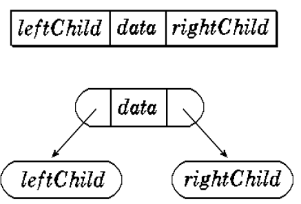
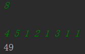
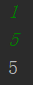
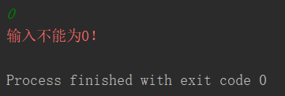

# Project7. Repairing the farm

**Author: 1851007 武信庭**

## Catalogue

[TOC]

## 1.Analysis


### 1.1 question background

The farmer wants to repair a fence in the ranch. He measured the fence and found that N pieces of wood are needed. Each piece of wood is an integer Li length unit, so he bought a long piece of wood that can be sawn into N pieces, that is, the wood. The length is the sum of Li.

But the farmer himself does not have a saw, and the reward for asking someone to saw the wood is proportional to the length of the wood. For the sake of simplicity, let us consider the remuneration equal to the length of the sawn wood. For example, to cut a piece of wood of length 20 into three sections of length 8, 7, and 5, the first sawn piece of wood will be sawn into 12 and 8, which costs 20; the second sawn piece of wood will be sawed to length 12 7 and 5 cost 12 and total cost 32 yuan. If the wood is sawn into 15 and 5 the first time, and the wood is sawed into 7 and 8 the second time, then the total cost is 35 (greater than 32).

### 1.2 functional analysis

**Input format:** The first line of the input gives a positive integer N (N <104), which means that the wood is to be sawn into N pieces. The second line gives N positive integers, indicating the length of each piece of wood.
**Output format:** output an integer, the minimum cost of sawing wood into N blocks.

This problem uses Huffman tree as the solution. Huffman tree is simply the tree with the shortest weighted path length, also known as the optimal binary tree. Then how to make its weighted path the shortest? Let's talk about the length of the weighted path first.

WPL = ∑wi · li means that the weight of a node is multiplied by its distance from the root, and this product of each node is added. The larger the node, the smaller the distance from the root

The specific process comes out. First, select the two points with the smallest weights, add the weights, and assign the weights to a new node. In the node list, the two nodes used to add will of course be deleted from the node list. If you go back and forth, you will get a Huffman tree. At this time, there is only one node in the node list


## 2.Design


### 2.1 data structure design

To solve this problem, i use a huffman tree as data structure. Given N weights as N leaf nodes, construct a binary tree. If the weighted path length of the tree reaches the minimum, such a binary tree is called an optimal binary tree, also known as a Huffman Tree. Huffman tree is the tree with the shortest weighted path, and the nodes with larger weights are closer to the root.




### 2.2 class structure design


| Name                                                         | Return value type | Description                               |
| ------------------------------------------------------------ | ----------------- | ----------------------------------------- |
| BuildTree(HuffmanTree_node huffman_tree[],const int ori_arr[],int num) | void              | build the huffmantree                     |
| SelectChild(HuffmanTree_node huffman_tree[], int target_pos, int &min1, int &min2) | void              | search for the smallest weight node       |
| PrintWPL(HuffmanTree_node huffman_tree[],int num)            | int               | print sum of minimum weighted path length |

 

## 3.Realization

### 3.1 BuildTree function

**core code**

```c++
void HuffmanTree::BuildTree(HuffmanTree_node huffman_tree[],const int ori_arr[],int num) {
    for (int i = 0; i < 2 * num - 1; ++i) {//初始化
        huffman_tree[i].lchild = huffman_tree[i].rchild = huffman_tree[i].parent =-1;
    }
    for (int i = 0; i < num; ++i) {//赋权值
        huffman_tree[i].weight = ori_arr[i];
    }
    for (int i = num; i < 2 * num - 1; ++i) {//建立父节点
        int target1,targer2;
        SelectChild(huffman_tree,i,target1,targer2);
        huffman_tree[target1].parent = huffman_tree[targer2].parent = i;
        huffman_tree[i].lchild = target1;
        huffman_tree[i].rchild = targer2;
        huffman_tree[i].weight = huffman_tree[target1].weight + huffman_tree[targer2].weight;
    }
}
```


### 3.2 SelectChild funtion

**core code**

```C++
void HuffmanTree::SelectChild(HuffmanTree_node huffman_tree[], int target_pos, int &min1, int &min2){
    for (int i = 0; i < target_pos; ++i) {//初始化min1、min2
        if(huffman_tree[i].parent == -1){
            min1 = i;
            for (int j = i+1; j < target_pos; ++j) {
                if(huffman_tree[j].parent == -1){
                    min2 = j;
                    break;
                }
            }
            break;
        }
    }

    for (int i = 0; i < target_pos; ++i) {//搜最小权值min1
        if(huffman_tree[i].parent == -1 && huffman_tree[i].weight < huffman_tree[min1].weight && i != min2){
            min1 = i;
        }
    }
    for (int j = 0; j < target_pos; ++j) {//搜最小权值min2
        if(huffman_tree[j].parent == -1 && huffman_tree[j].weight < huffman_tree[min2].weight && j != min1){
            min2 = j;
        }
    }
}
```


### 3.3 PrintWPL function

**core code**

```C++
int HuffmanTree::PrintWPL(HuffmanTree_node *huffman_tree, int num) {
    int ans = 0;
    for (int i = 0; i < 2 * num - 1; ++i) {
        if(huffman_tree[i].lchild != -1 && huffman_tree[i].rchild != -1){
            ans += huffman_tree[i].weight;//将所有父节点权值相加得最小带权路径长度和（未实现路径长度赋值）
        }
    }
    return ans;
}
```


## 4.Test

### 4.1 general condition 

**Input:**

8 

4 5 1 2 1 3 1 1

**Expected Result:**

49

**Actual Result:**




### 4.2 input only one number

**Input:**

1

5

**Expected Result:**

5

**Actual Result:**





### 4.3 input none

**Input:**

0

**Expected Result:**

error reminder

**Actual Result:**

 


