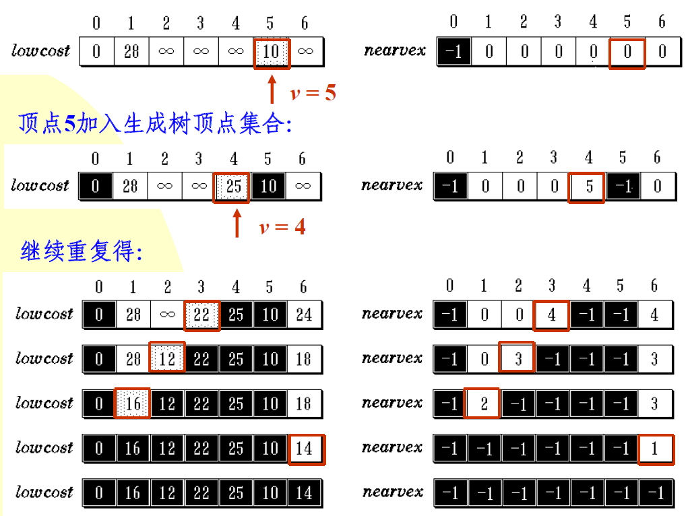
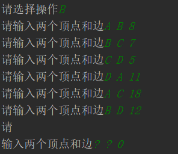
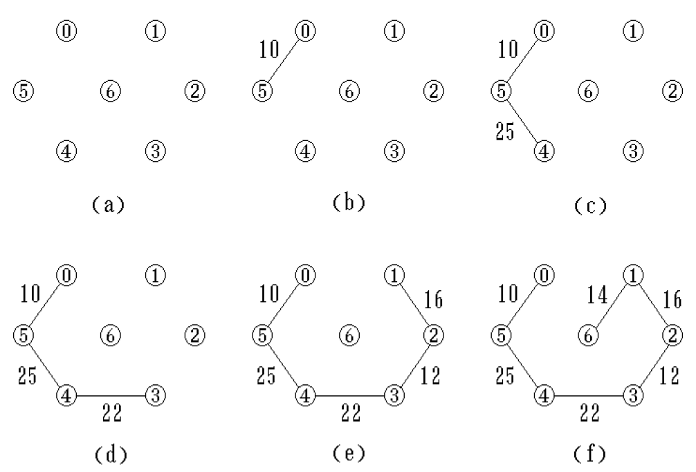
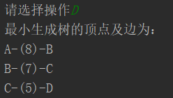
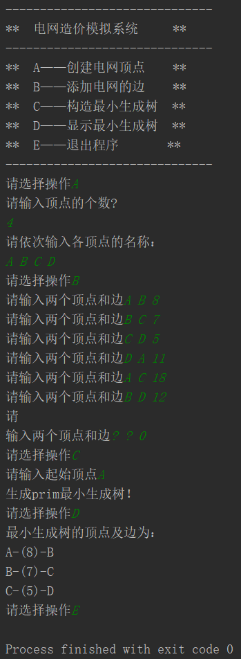

# Project8. Grid Construction Cost Simulation System

**Author: 1851007 武信庭**

## Catalogue

[TOC]

## 1.Analysis


### 1.1 question background

Assume that there are n communities in a city. To realize that the power grids between the n communities can be connected to each other, the power grid between the n communities in this city is constructed so that the total project cost is the lowest. Please design a cost solution that can meet the requirements.

The problem is a complicated problem which calls for demands of graph usage.Just as In our life, things are not always such simple that can always be  stored in arrays, lists or trees. Sometimes we need to express the  relationship between several nodes, and these nodes are equal, without  precedence order. In this way, linked list and tree structure is not  suitable to deal with this kind of problem. It's the time for Graph to  come on board.

In addition, This problem depict a situation that make a plan to link several  point with the minimum cost, which need to use related knowledge of minimum cost spanning tree


### 1.2 functional analysis

A grid line can be set up between each district, and corresponding economic costs must be paid. There can be at most n (n-1) / 2 lines between n cells, and selecting n-1 of them can minimize the total cost.

In graph theory, a connected graph tree with n nodes is the minimal connected subgraph of the original graph, and contains all n nodes in the original graph, the least side of the pass. The minimum spanning tree can be obtained using the kruskal (primary) algorithm.

In a given undirected graph G = (V, E), (u, v) represents the edge (ie) connecting vertex u and vertex v, and w (u, v) represents the weight of this edge, if it exists T is a subset (ie) of E and is an acyclic graph such that
W (T) is the smallest, then this T is the minimum spanning tree of G.

The minimum spanning tree is actually an abbreviation for the minimum weight spanning tree


## 2.Design


### 2.1 data structure design

> Prim algorithm (Prim algorithm), an algorithm in graph theory, can search the minimum spanning tree in the weighted connected graph. This means that the tree formed by the subset of edges searched by this algorithm not only includes all vertices (Vertex (graph theory)) in the connected graph, but also the sum of the weights of all its edges is the smallest. The algorithm was discovered by Czech mathematician Vojtěch Jarník in 1930; it was independently discovered by American computer scientist Robert C. Prim in 1957; in 1959, Aiz G. Dicoscher discovered the algorithm again. Therefore, in some cases, the Prim algorithm is also known as the DJP algorithm, the Yarnik algorithm, or the Prim-Yarnik algorithm.


The algorithm may informally be described as performing the following steps:

1. Initialize a tree with a single vertex, chosen arbitrarily from the graph.

2. Grow the tree by one edge: of the edges that connect the tree to vertices  not yet in the tree, find the minimum-weight edge, and transfer it to  the tree.

3. Repeat step 2 (until all vertices are in the tree).

   


### 2.2 class structure design

+ member functions

| Name          | Return value type | Description                       |
| ------------- | ----------------- | --------------------------------- |
| buildNodes()  | void              | build the graph nodes             |
| appendLines() | void              | append lines and p[oints to graph |
| setupPrim()   | void              | prim algorithm                    |
| displayPrim() | void              | display the result of prim        |

  

### 2.3 Auxiliary array design

During the construction process, two auxiliary arrays are also set: lowcost [] [] stores the current minimum weights of the vertices in the spanning tree vertex set to the sides of each vertex outside the spanning tree; nearvex [] [Records the spanning tree vertex set Each outer vertex is closest to which vertex in the set (that is, the weight is the smallest).




## 3.Realization

### 3.1 buildNodes function

**core code**

```c++
void graph::buildNodes() {
    cout << "请输入顶点的个数?" << endl;
    cin >> node_nums;
    cout << "请依次输入各顶点的名称："<< endl;
    for (int i = 0; i < node_nums; i++) {
        cin >> node[i];
    }
}
```
**screenshot**


### 3.2 appendLines function

**core code**

```C++
void graph::appendLines() {
    char node1='1', node2='1'; int len=1;
    while (true) {
        cout << "请输入两个顶点和边";
        cin >> node1 >> node2 >> len;
        if (node1 == '?') {
            break;
        }
        for (int i = 0; i < node_nums; ++i) {
            for (int j = 0; j < node_nums; ++j) {
                if(node1 == node[i] && node2 == node[j]){
                    adjMat[i][j] = len;
                }
            }
        }
    }
    for(int i = 0; i < node_nums; i++){
        for(int j = 0; j < node_nums; j++){
            if(i == j) adjMat[i][j] = 0;
            else if(!adjMat[i][j]) adjMat[i][j] = maxint;
            }
        }
}
```

**screen shot**




### 3.3 setupPrim function

**principle**



**core code**

```C++
void graph::setupPrim() {
    cout << "请输入起始顶点";
    char start_node;
    int start_num = 0;
    cin >> start_node;
    for (int i = 0; i < node_nums; ++i) {
        if (node[i] == start_node) {
            start_num = i;
            break;
        }
    }
    for (int i = 0; i < node_nums; ++i) {
        lowcost[i] = adjMat[start_num][i];
        mst[i] = start_num;
    }
    mst[start_num] = -1;
    for (int i = 0; i < node_nums - 1; ++i) {
        int min_cost = maxint;
        int min_node_num = -1;
        for (int j = 0; j < node_nums; ++j) {
            if(mst[j] != -1 && lowcost[j] < min_cost){
                min_cost = lowcost[j];
                min_node_num = j;
            }
        }
        if(min_node_num != -1){
            display_node[i].first_node = node[mst[min_node_num]];
            display_node[i].second_node = node[min_node_num];
            display_node[i].node_cost = lowcost[min_node_num];
            mst[min_node_num] = -1;
            for (int j = 0; j < node_nums; ++j) {
                if(mst[j] != -1 && lowcost[j] >adjMat[min_node_num][j]){
                    lowcost[j] = adjMat[min_node_num][j];
                    mst[j] = min_node_num;
                }
            }
        }
    }
    cout << "生成prim最小生成树！"<<endl;
}
```

**screen shot**


### 3.4 displayPrim function

**core code**

```C++
void graph::displayPrim() {
    cout << "最小生成树的顶点及边为："<<endl;
    for (int i = 0; i < node_nums-1; ++i) {
        cout << display_node[i].first_node << "-(" << display_node[i].node_cost
             << ")-" << display_node[i].second_node << endl;
    }
}
```

**screen shot**




## 4.Test

### normal condition



## 5.Compilation information

### 5.1 CMakeLists

```c++
cmake_minimum_required(VERSION 3.15)

project(project8)

set(CMAKE_CXX_STANDARD 14)

add_executable(project8 main.cpp)

set(CMAKE_EXE_LINKER_FLAGS -static)
```


### 5.2 File Encoding

+ coding with **GBK**

  

### 5.3 Cross-platform Compilation 

Executables are cross-platform compiled in **Windows(.exe)** and **Linux(.out)**