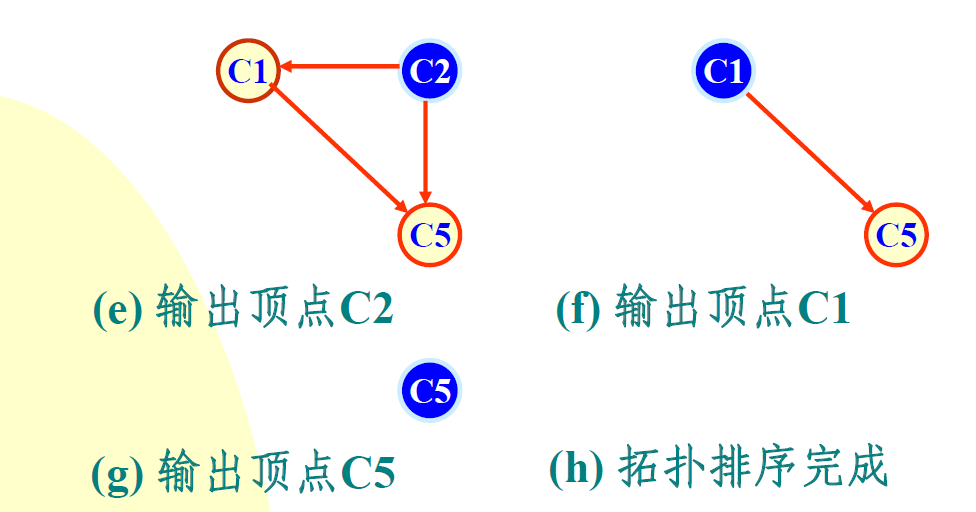

# Project9. Course scheduling software

**Author: 1851007 武信庭**

## Catalogue

[TOC]

## 1.Analysis


### 1.1 question background

Courses are arranged for each major at the university. Assume that any major has a fixed period of study. Each academic year contains two semesters. The courses offered by each major are determined, and the schedule of the courses must meet the prerequisite relationship. The prerequisites for each course are determined. Each course takes exactly one semester, assuming that there are five lessons each morning and afternoon. It is on this premise to design a teaching plan preparation process.

As the question showed, we need a new sorting manner which called topological sort. In computer science, a topological sort or topological ordering of a directed graph is a linear ordering of its vertices such that for every directed edge uv from vertex u to vertex v, u comes before v in the ordering. 


### 1.2 functional analysis

**The input data includes:** 

+ the number of courses offered in a semester (the sum of the number of courses offered in each semester must be equal to the total number of courses)
+ the course number
+ the course name
+ the number of weekly hours
+ the designated semester( If the designated start semester is 0, it means that there is a computer to designate the start semester.)
+ the prerequisites

If the input data is not reasonable, such as the number of courses offered each semester and the total number of courses are not equal, appropriate prompt information should be displayed.

Use text files to store the lesson schedules for each semester.

Store the input data in a text file and load it into the computer.The lessons information is as following picture showed.


### 1.3 arrangement analysis

Assume that there are classes from Monday to Friday. There are 10 lessons per day. The first major session is 1-2. The second major session is 3-5. The third major session is 6-7. The 4 major sections are 8-10 lessons. When arranging lessons, if there are 3 lessons in a course, 3 consecutive lessons will be given priority; if 3 consecutive lessons cannot be arranged, then 2 lessons will be given consecutively. Reschedule a single lesson; if a course needs to be scheduled for two days, for better teaching results, it is best not to arrange for two consecutive days, such as giving priority to two lessons apart, and set weekday to indicate that the current schedule Working day, the working day of the next scheduled class is: weekday = (weekday + 2-5)? (Weekday + 2-5): (weekday + 2)


## 2.Design


### 2.1 data structure design

In order to schedule the courses with particular prerequisites and certain hours, i choose to use graph and topological sorting algorithm.The process of topo search is as follwing pictures showed.

> The canonical application of topological sorting is in scheduling a sequence of jobs or tasks based on their dependencies. The jobs are represented by vertices, and there is an edge from x to y if job x must be completed before job y can be started (for example, when washing clothes, the washing machine must finish before we put the clothes in the dryer). Then, a topological sort gives an order in which to perform the jobs. A closely related application of topological sorting algorithms was first studied in the early 1960s in the context of the PERT technique for scheduling in project management (Jarnagin 1960); in this application, the vertices of a graph represent the milestones of a project, and the edges represent tasks that must be performed between one milestone and another. Topological sorting forms the basis of linear-time algorithms for finding the critical path of the project, a sequence of milestones and tasks that controls the length of the overall project schedule. 


The graph shown above has many valid topological sorts, including:

- 5, 7, 3, 11, 8, 2, 9, 10 (visual left-to-right, top-to-bottom)
- 3, 5, 7, 8, 11, 2, 9, 10 (smallest-numbered available vertex first)
- 5, 7, 3, 8, 11, 10, 9, 2 (fewest edges first)
- 7, 5, 11, 3, 10, 8, 9, 2 (largest-numbered available vertex first)
- 5, 7, 11, 2, 3, 8, 9, 10 (attempting top-to-bottom, left-to-right)
- 3, 7, 8, 5, 11, 10, 2, 9 (arbitrary)

In addtion, in the relization of graph structure, i also use the container **vector** which is a especially useful container  written by myself in project 6 as the header file 'vector.h'.Cause i use it simply as an various length array, i just add push_back and several basic function to it.And for the extra use and debug, i add a little bit funtion to it.


+ member variables

| Name    | Property | Type  | Description |
| ------- | -------- | ----- | ----------- |
| size    | private  | int   | 数组大小    |
| space   | private  | int   | 数组容量    |
| element | private  | type* | 元素        |


+ member functions

| Name                               | Return value type | Description                                    |
| ---------------------------------- | ----------------- | ---------------------------------------------- |
| Vector()                           | Constructor       | Construct the class                            |
| Vector(int len)                    | Constructor       | Construct the class with length                |
| Vector(const Vector& other)        | Constructor       | Construct the class with another copied vector |
| Vector(initializer_list<type>list) | Constructor       | Construct the class with list                  |
| ~Vector()                          | Destructor        | Destruct the class                             |
| operator[] (int i)                 | type&             | overloaded operator []                         |
| reserve(int newalloc)              | void              | reserve new space                              |
| push_back(type &val)               | void              | add element                                    |
| get_size() const                   | int               | get the size of vector                         |
| del()                              | void              | delete the vector                              |


### 2.2 class structure design

+ member functions

| Name                           | Return value type | Description                    |
| ------------------------------ | ----------------- | ------------------------------ |
| build()                        | void              | build the graph nodes form txt |
| TopoSearch(int sem, int count) | int               | sort in topologic              |
| output()                       | void              | output the result in txt       |

  

## 3.Realization

### 3.1 build function

**principle**


**core code**

```c++
void graph::build(){
    cout << endl;
    cout << "是否使用默认路径？(Y/n)";
    cin >> temp;
    if (temp == "n") {
        cout << "请输入文件路径： " ;
        cin >> INPUT_PATH;
        inf.open(INPUT_PATH);
        if (!inf) {
            cerr << endl << "路径无效，使用默认路径！ " <<endl;
            INPUT_PATH="../input.txt";
            inf.open(INPUT_PATH);
        }
    }
    while (!inf.eof()) {
        course bufCourse;
        inf >> bufCourse;
        if (bufCourse.semester > maxSem) maxSem = bufCourse.semester;
        courses.push_back(bufCourse);
        totalHours += bufCourse.hours;
        ++semCount[bufCourse.semester];
    }
    for (int i = 0; i < courses.get_size(); ++i) {
        ind[i] = courses[i].pre_course.get_size();
        for (int j=0; j< courses.get_size(); ++j)
            for (int k=0; k<courses[j].pre_course.get_size(); ++k)
                if (courses[j].pre_course[k]==courses[i].code) {
                    next_course[i].push_back(j);
                    break;
                }
    }
}
```
**screenshot**


### 3.2 TopoSearch function

**process**





**core code**

```C++
int graph::TopoSearch(int sem, int count) {
    if(count == courses.get_size()) output();
    if (sem == maxSem +1) return 0;
    if (curTotalHours + (maxSem-sem+1)*50 < totalHours) return 0;
    if (hours[sem]>50) return 0;

    for (int i=0; i<courses.get_size(); ++i)
        if (courses[i].semester==0 || courses[i].semester==sem)
            if (ind[i]==0 && !used[i] && sem>=atleast[i]) {
                int tempLeast[1000];
                for (int j=0; j<next_course[i].get_size(); ++j) {
                    --ind[next_course[i][j]];
                    tempLeast[next_course[i][j]]=atleast[next_course[i][j]], atleast[next_course[i][j]]=sem+1;
                }
                used[i] = true; curTotalHours+=courses[i].hours; hours[sem]+=courses[i].hours;
                semCount[sem]-=(courses[i].semester==sem)?1:0;
                order_courses[sem].push_back(courses[i]);
                TopoSearch(sem, count+1);
                used[i] = false; curTotalHours-=courses[i].hours; hours[sem]-=courses[i].hours;
                semCount[sem]+=(courses[i].semester==sem)?1:0;
                order_courses[sem].Delete(order_courses[sem].get_size() - 1);
                for (int j=0; j<next_course[i].get_size(); ++j) {
                    ++ind[next_course[i][j]];
                    atleast[next_course[i][j]] = tempLeast[next_course[i][j]];
                }
            }
    if (semCount[sem]==0) TopoSearch(sem+1, count);
    return 0;
}
```


### 3.3 output function

**core code**

```C++
void graph::output() {
    for (int i=1; i<=maxSem; ++i) {
        memset(&table[0][0],0,sizeof(table));
        memset(avai,0,sizeof(avai));
        outf <<endl<< "第 " << i << " 学期: "<<endl ;
        if (i==6) {

        }
        for (int j = 0; j < order_courses[i].get_size(); ++j) {
            for (int d=1; d<=11; ++d)
                for (int t=4; t>=1; --t) {
                    if (!avai[jumpDay[d]][t] && weektime[jumpDay[d]][t] == 3 && order_courses[i][j].hours >= 3) {
                        avai[jumpDay[d]][t] = true;
                        order_courses[i][j].hours -= 3;
                        for (int k = 0; k < weektime[jumpDay[d]][t]; ++k) table[jumpDay[d]][jumpTime[t] + k] = j + 1;
                        break;
                    }

                    if (!avai[jumpDay[d]][t] && weektime[jumpDay[d]][t] == 2 && order_courses[i][j].hours >= 2) {
                        avai[jumpDay[d]][t] = true;
                        order_courses[i][j].hours -= 2;
                        for (int k = 0; k < weektime[jumpDay[d]][t]; ++k) table[jumpDay[d]][jumpTime[t] + k] = j + 1;
                        break;
                    }
                }
        }
        for (int j = 0; j < order_courses[i].get_size(); ++j)
            while (order_courses[i][j].hours>0)
                for (int k = 1; k<=50; ++k)
                    if (table[(k/10)+1][k%10+1]==0) {
                        table[(k/10)+1][k%10+1]=j;
                        --order_courses[i][j].hours;
                        break;
                    }
        for (int p=1; p<=10; ++p) {
            for (int j = 1; j <= 5; ++j)
                if (table[j][p]==0) outf << setw(5) << setiosflags(ios::left) << "无  ";
                else outf << setw(5) << setiosflags(ios::left) << order_courses[i][table[j][p]-1].name << "  ";
            outf << endl;
        }
        outf << endl;
    }
    cout << endl << "课表保存成功！ " <<endl;
    inf.close();
    outf.close();
    exit(0);
}
```

**screen shot**


## 4.Test

### normal condition
**output.txt**


